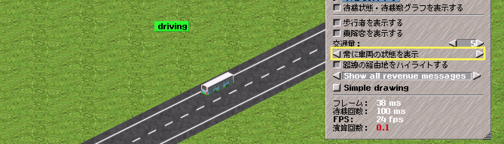
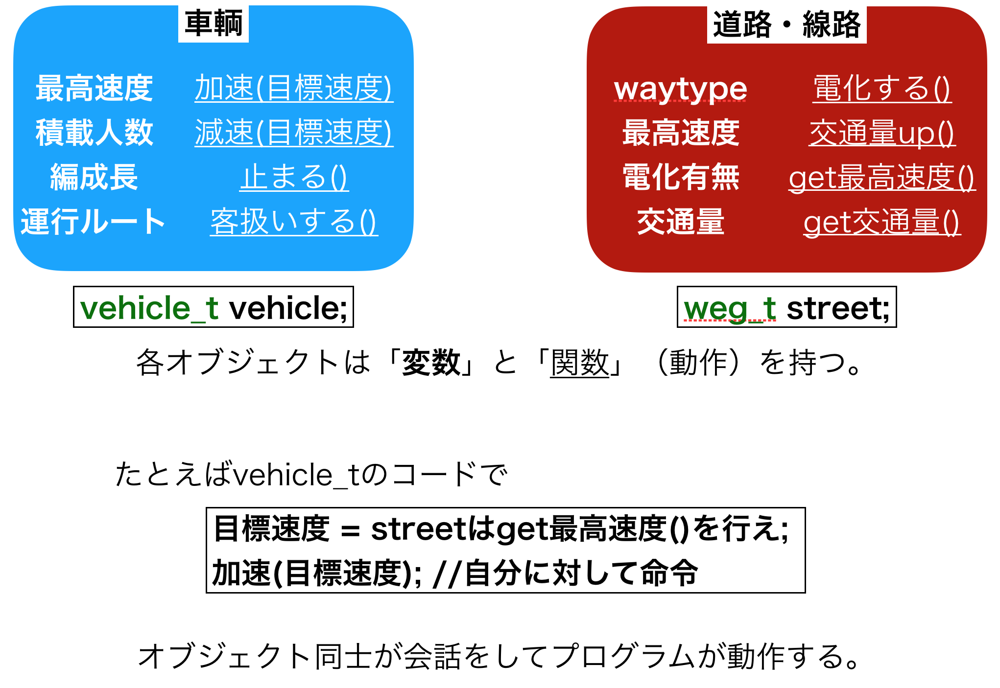
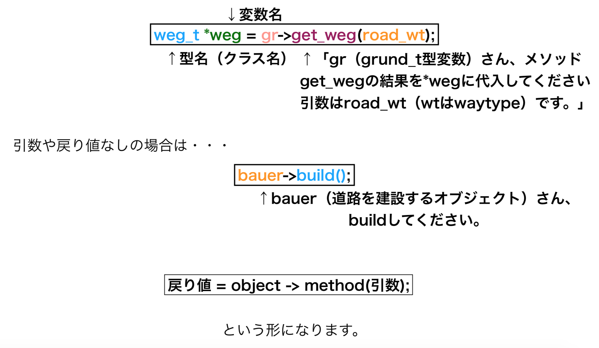
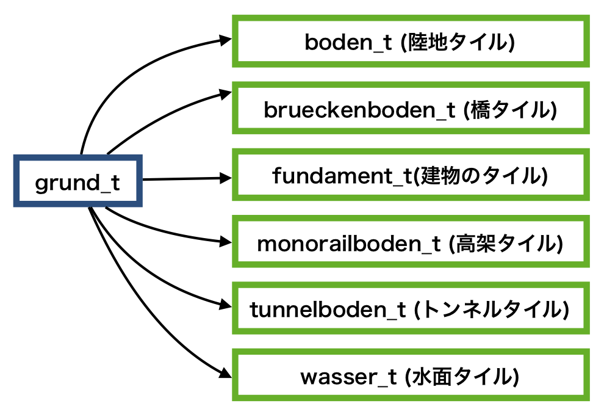
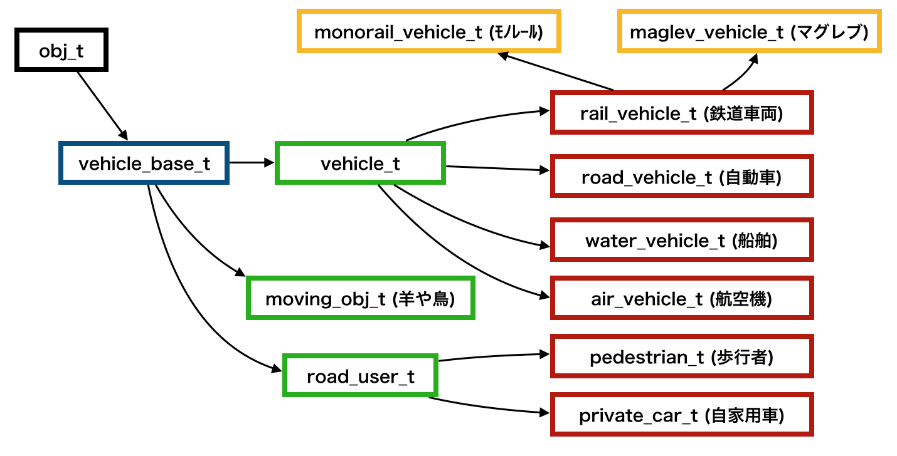
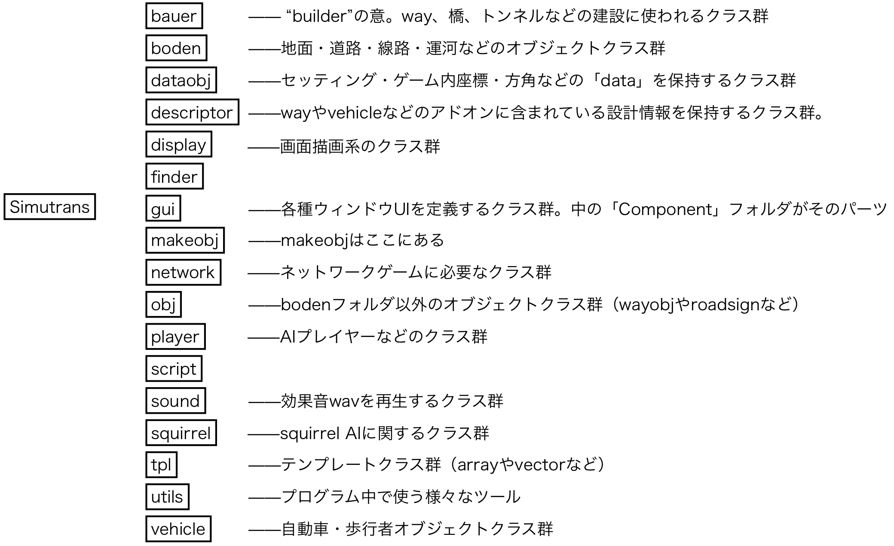

# Simutransコーディング概論
本章はsimutransのごく簡単な本体改造から始まる．その後，C++の簡単な説明をし，simutransコードの設計思想，コード構成，コードの読み方などを概観する．

## はじめての本体改造
プログラミングの習得には「まずはともかく動かしてみる」ことが重要である．そこで，はじめての本体改造として，図\ref{driving_status}のように走行中の車両が「driving」の表示を出すように改造してみよう．なお，この表示を出すには表示の設定ウィンドウから*「常に車両の状態を表示」* に設定する必要がある．



vehicle/simvehicle.cc（ソースコードディレクトリのvehicleフォルダに入ってるsimvehicle.ccというファイルを指す）の1759行目周辺に，コード\ref{show_dr_b}のような記述がある．
`case convoi_t::DRIVING:`という文字列をエディタで検索すればすぐに見つけることができるだろう．この箇所は図\ref{driving_status}のように車両のステータスを表示する処理を記述している．コード\ref{show_dr_b}の5行目に`go home`という文字列が見えるように，「回送」などといった状態表示はここで定義されているのである．

```C++:今回コードを編集する箇所
case convoi_t::DRIVING:
if(  state>=1  ) {
  grund_t const* const gr = welt->lookup(cnv->get_route()->back());
  if(  gr  &&  gr->get_depot()  ) {
    tstrncpy( tooltip_text, translator::translate("go home"), lengthof(tooltip_text) );
    color = color_idx_to_rgb(COL_GREEN);
  }
  else if(  cnv->get_no_load()  ) {
    tstrncpy( tooltip_text, translator::translate("no load"), lengthof(tooltip_text) );
    color = color_idx_to_rgb(COL_GREEN);
  }
}
break;
```

それでは先ほどのコードに「driving」ステータスを表示させるコードを追記しよう．\underline{コード\ref{show_dr_a}の12行目〜15行目}が追記したコードである．13・14行目は5・6行目をコピペして文字列を編集すればよい．実際のvehicle/simvehicle.ccでは1769行目周辺にコードを挿入することになる．コードを追記したらコンパイルして車両を走らせてみよう．無事に「driving」を表示させられただろうか？

\begin{lstlisting}[label=show_dr_a, caption=今回コードを編集する箇所, style=customC]
case convoi_t::DRIVING:
if(  state>=1  ) {
  grund_t const* const gr = welt->lookup(cnv->get_route()->back());
  if(  gr  &&  gr->get_depot()  ) {
    tstrncpy( tooltip_text, translator::translate("go home"), lengthof(tooltip_text) );
    color = color_idx_to_rgb(COL_GREEN);
  }
  else if(  cnv->get_no_load()  ) {
    tstrncpy( tooltip_text, translator::translate("no load"), lengthof(tooltip_text) );
    color = color_idx_to_rgb(COL_GREEN);
  }
  else {
    tstrncpy( tooltip_text, translator::translate("driving"), lengthof(tooltip_text) );
    color = color_idx_to_rgb(COL_GREEN);
  }
}
break;
\end{lstlisting}

今回は既存のコードに4行追記することで「driving」を表示させることができた．この4行で何が行われたのか，簡単に整理しよう．

コード\ref{show_dr_a}の14行目`color = color_idx_to_rgb(COL_GREEN);`はステータス表示の色を緑に設定しているコードである．`color`という{\bf 変数}に`color_idx_to_rgb(COL_GREEN)`を代入している．「緑」であることは`COL_GREEN`が表しているので，例えばこれを`COL_RED`に変更すれば表示は赤色になる．実際に試してみよう．なお，赤がなぜ`COL_RED`なのかはここでは深入りしないでおく．

今回追記したコードに`else`という単語が出てきた．これは{\bf if - else文}と呼ばれるC言語の構文の一部である．重要な構文であるからおさらいしておこう．

\begin{lstlisting}[label=if_basics, caption=条件分岐構文（If文）, style=customC]
int a = 10;
if(  a > 5  ) {
  // 処理A
} else {
  // 処理B
}
\end{lstlisting}

コード\ref{if_basics}は変数`a`が5より大きければ処理A，そうでなければ処理Bを実行するコードである．1行目では`a`という変数を{\bf int型}（整数型）で宣言し，10という数字を代入している．今回は`a`は10で，5より大きいので処理Aが実行され，処理Bは実行されない．

## C++
C++は大変巨大な仕様を持った言語であり，全てを理解することは至難の業である．しかし，simutransで必要なのはそのうちのほんの一部である．具体的には，クラスおよびオブジェクト指向の基本がわかっていれば十分である．

C++はC言語の進化系と言うべき言語である．C言語に不慣れな場合はまず『苦しんで覚えるC言語』（\url{https://9cguide.appspot.com/}）でC言語を習得してほしい．特に
\begin{description}
  \item[ポインタ]ポインタは変数へのショートカットである．
  \item[構造体]構造体を使うと複数の変数をまとめて扱うことができる．
\end{description}
の2つはC++を理解するのに大変重要であるから，よく習得してほしい．

C++については『ロベールのC++教室』（\url{http://www7b.biglobe.ne.jp/~robe/cpphtml/html02/menu02.html}）が大変わかりやすく詳しく説明している．初学者はこれの1章〜30章を理解すれば，まずは十分である．以下，読者の理解の助けになるようにSimutransに必要なC++の最低限の知識を解説する．

なお，この章はsimutransのコーディングに最低限必要なオブジェクト指向の概念を初学者にわかりやすく提示することが目的であり，一般に言われるオブジェクト指向の正しい理解を提供するものではない．


\subsection{class}
C++ではCにおける構造体の拡張のようなものとして，classを定義する．例えば「車」を表すclassは次のようになる．
\begin{lstlisting}[label=car_class, caption=車クラス, style=customC]
class 車{
  // ↓車の性質
  ナンバー;
  ガソリン量;
  // ↑車の性質
  // ↓車の機能
  ナンバーを決める();
  ガソリンを入れる();
  ナンバーとガソリン量を表示する();
};
\end{lstlisting}
C言語では車の「ナンバー」と「ガソリン量」をひとまとめにして構造体として扱うことができた．C++ではさらに「機能」も定義して「モノ」を表すことができる．機能は関数の形で書く．

オブジェクト指向では，「モノ」が協調して動作することでプログラムが動くと考える．車であれば，性質（パラメータ）としてナンバーとガソリン量，機能としてコード\ref{car_class}のようなものを定義することになる．（もちろん速度や移動距離など他にも定義すべきことはたくさんあるだろう．）

ここで定義したclassはいわば「車の設計書」である．実際に車オブジェクトを使うときは，設計書からインスタンス（=モノ）を生成する．C++ではふつうオブジェクトはポインタで扱う．

```
Car *car1 = new Car();
Car *car2 = new Car();
```

これで`Car`クラスという設計書から`car1`と`car2`が生成された．この2つは別の車である．



もう少し実際のsimutransのコードに近い形で考えてみよう．図\ref{class_in_simu}をみてほしい．例として，車輌と道路・線路について見る．
車輌（運行スケジュールがあるもの）は`vehicle_t`，道路や線路は`weg_t`というクラス名で定義されている．図\ref{class_in_simu}の枠内左側，「最高速度」「積載人数」などが変数である．枠内右側，「加速」「減速」などは関数である．各オブジェクトが変数（=状態）と関数（=機能）を持っていることがわかるだろう．

車輌が自分の速度を更新する時を考えよう．目標速度を道路の最高速度とすると，車輌オブジェクトは道路オブジェクトに対して「最高速度を教えてくれ（get最高速度）」と命令し，道路オブジェクトが返した結果を目標速度として保存する．そして，車輌オブジェクトは自身の機能「加速」を使い，速度を更新するのである．



simutransのコードで中心的なコードは，オブジェクトに命令をして，命令の結果返ってきた値を適当な変数に代入することである．図\ref{command}はその様子を示している．ここでは，`grund_t`（地面）オブジェクトに対して`get_weg`をするよう命令している．そのさい，アロー演算子（` ->` ）が使われている．これは，grがポインタ型だからである．命令するオブジェクトが実オブジェクト（ポインタではない）の場合は

\begin{lstlisting}[caption=実オブジェクトは.（ドット）で命令, style=customC]
koord3d pos = route.at(i); // routeは実オブジェクトなので.（ドット）を使う
\end{lstlisting}
のように書く．ちなみに，`koord3d`は三次元座標の型である．

\subsection{継承}
simutransにおける「乗り物」を考えてみよう．simutransでは大きく分けて「鉄道」「自動車」「船舶」「飛行機」といった乗り物がある．したがって，プログラムではそれぞれに対応したクラスを作ることになる．

しかし，よく考えてみよう．いずれの場合でも，「スピード」や「位置」といった多くのパラメーターや機能は共通である．共通のパラメータや機能をそれぞれのクラスで別個に定義するのはムダであるし，メンテナンス性も悪い．

そこで，乗り物としての共通の性質をまとめた「vehicle」というクラスを作る．鉄道や自動車などは「vehicle」から派生させれば，ムダなくコードを記述することができる．このように，あるクラスから別のクラスを派生させることを\underline{\bf{継承}}という．実際のクラス定義はコード\ref{rail_vehicle}のようになる．ここでは，`vehicle_t`から`rail_vehicle_t`を派生させている．

\begin{lstlisting}[caption=rail\_vehicle\_tの定義, style=customC, label=rail_vehicle]
class vehicle_t{
  koord3d pos;
  koord3d get_pos() { return pos; }
};

// class サブクラス名 : 親クラス名　の形で定義
class rail_vehicle_t : vehicle_t {
  // メンバ変数や関数
};
\end{lstlisting}

`rail_vehicle_t`は鉄道車両のクラスである．このクラスは`vehicle_t`を継承しており，`vehicle_t`のメンバ変数や関数を引き継いでいる．`rail_vehicle_t`の中ではget\_pos()は定義されていない．したがって，`rail_vehicle_t`オブジェクトについて`get_pos()`を呼び出した場合は親クラスの`vehicle_t`で定義された`get_pos()`が呼び出される．

継承そのものの詳しいことについては，ロベールのC++教室第二部11章（\url{http://www7b.biglobe.ne.jp/~robe/cpphtml/html02/cpp02011.html}）以降を参照されたい．これ以降は，simutransにおける代表的なクラスの継承関係を見てみよう．

図\ref{inh_grund}は地面タイルオブジェクトの継承関係を表した図である．`grund_t`で地面タイルに共通した性質・機能を定義し，陸地，タイル，建物，高架と各種派生させている．実は，高架やトンネル内も「地面」オブジェクトがきちんと生成されているのである．水面も`grund_t`を継承する形でタイルとして定義されている．



続いて，もう少し複雑な例を見ていこう．図\ref{inh_vehicle}は乗り物まわりの継承を表した図である．ここでの共通の祖先は`vehicle_base_t`である．そこから`vehicle_t`などが派生，さらに`rail_vehicle_t`などのクラスが派生している．モノレールやマグレブは鉄道車両のクラスを継承する形で定義されている．興味深いのは，同じ道路上を走る自動車（`road_vehicle_t`）と自家用車（`private_car_t`）が別の祖先を持っているということである．`vehicle_t`はスケジュールを持って運行する車両のクラスである．自家用車はスケジュールを持たずランダムな動きをするため，`vehicle_t`ではなく`road_user_t`を継承しているのである．
  


\subsection{実装ファイルとヘッダファイル}
simutransのコードディレクトリを眺めていると，「simcity.cc」「simcity.h」のように同名で拡張子が.ccと.hのペアを多数見られる．両者には以下のような関係がある．
\begin{itembox}[c]{.hと.cc}
  \begin{description}
    \item[***.h]ヘッダファイル．オブジェクトの「変数」と「関数」が定義されている．
    \item[***.cc]実装ファイル．各関数の処理の中身が書かれている．
  \end{description}
\end{itembox}

コード\ref{simcity.h}およびコード\ref{simcity.cc}はそれぞれsimcity.h，simcity.ccの抜粋である．`remove_gebaeude_from_stadt()`は与えられた建物を都市から取り除く関数である．ヘッダファイルには，メンバ変数と関数の宣言のみが書かれている．関数の実装は.cc（実装）ファイルに書かれている．

\begin{lstlisting}[caption=simcity.h（ヘッダファイル）抜粋, style=customC, label=simcity.h]
// メンバ変数と関数の宣言が書かれている
class stadt_t{
private: 
  // メンバ変数
  koord pos;
  bool allow_citygrowth;
  
  // 関数は宣言のみ
  void remove_gebaeude_from_stadt(gebaeude_t *gb);
}
\end{lstlisting}
\begin{lstlisting}[caption=simcity.cc（実装ファイル）抜粋, style=customC, label=simcity.cc]
// 関数の実装が書かれている
void stadt_t::remove_gebaeude_from_stadt(gebaeude_t* gb)
{
	buildings.remove(gb);
	gb->set_stadt(NULL);
	recalc_city_size();
}
\end{lstlisting}

あるオブジェクトを使うのに必要な情報は「そのオブジェクトがどんな状態を持っているのか」と「そのオブジェクトで何ができるのか」である．例えば先の例の場合，「都市」は「建物をその都市から除去する」機能をもつことを知っていれば十分である．その機能がどのように為されるのかを知る必要は（たいていの場合）ない．ソースを読むときは，まずヘッダファイルを読むことでそのオブジェクトが持つ状態と機能を知ることができる．逆に言えば，ヘッダファイルを読んだだけでオブジェクトの状態と機能が一目瞭然であるようにコードを書かねばならない．

ちなみに，ごく短い関数の場合は処理の中身までヘッダファイルに書き込むことがある．これはsimutransのコードにおいてもしばしば見られる．しかし，ヘッダファイルが冗長になる上にコード編集後の再コンパイルの負担が高くなる（.ccファイルを編集してもそのファイルだけ再コンパイルすれば済むが，ヘッダファイルを編集するとincludeしているファイルを全て再コンパイルせねばならない）ので避けたほうが懸命である．

  {変数の型について}
vehicleディレクトリにあるsimvehicle.hを覗いてみよう．以下は一部抜粋したものである．
\begin{lstlisting}[caption=vehicle/simvehicle.h, style=customC, label=4]
class vehicle_t : public vehicle_base_t, public test_driver_t
{
private:
	/**
	* Date of purchase in months
	* @author Hj. Malthaner
	*/
	sint32 purchase_time;

	/* For the more physical acceleration model friction is introduced
	* frictionforce = gamma*speed*weight
	* since the total weight is needed a lot of times, we save it
	* @author prissi
	*/
	uint32 sum_weight;

	grund_t* hop_check();
\end{lstlisting}
定義されている変数の型名に注目してほしい．おなじみの「int」や「double」ではなく「`sint32`」や「`uint32`」という文字が並んでいる．

実は，simutransではコーディング規約として原則「int」や「long」を使うことが禁止されている．これはコンパイラによって「int」が16ビット整数を表すのか32ビット整数を表すのか異なるためである．異なるプラットフォームで全く同じように動作せねばならないsimutransでは，このようなことは許されることではない．そのかわり，整数型では以下の型名を使う．

\begin{itembox}[c]{Simutransの整数型}
  \begin{description}
    \item[uint8]unsigned int 8bit (0〜255)
    \item[sint8]signed int 8bit (-128〜127)
    \item[uint16]unsigned int 16bit (0〜$2^{16}-1$)
    \item[sint16]signed int 16bit ($-2^{15}$〜$2^{15}-1$)
    \item[uint32]unsigned int 32bit (0〜$2^{32}-1$)
    \item[sint32]signed int 32bit ($-2^{31}$〜$2^{31}-1$)
  \end{description}
\end{itembox}

floatやdoubleといった浮動小数点数の型は用意されていない．これは，浮動小数点演算には必ず丸め誤差が伴い，Networkゲームなどでこの誤差が問題になることがあるからである．したがって，例えば割合を計算するときでも小数点型を使わずにコードを書く必要がある．

コード\ref{4}の17行目を見ると，地面オブジェクトの型名は「`grund_t`」となっている．この「\_t」はtypeという意味で，数多くの型名の末尾に「\_t」がつけられている．（そういう習慣であって言語仕様的なものではない．）

ところで「地面」の英語は「ground」のはずである．「grund」とは何かというと，これはドイツ語である．道はweg，道路はstrasse，編成はconvoi，橋はbrueckenである．ドイツ語については本家フォーラムの \url{http://forum.simutrans.com/index.php?topic=12734.0} に便利な対応表があるので参照すると良い．コード内のコメントや変数名などにもドイツ語が多数残っている．ドイツ語を読むときは，翻訳サイトでドイツ語→\underline{\bf{英語}}を使うとよい．（日本語翻訳を使うと大抵の場合よくわからない出力が出てくる．）

## simutransコードのディレクトリ構成
クラスはヘッダファイルと実装ファイルに分けて記述される．そして，大抵の場合1つのファイルには1つのクラスが書かれているのである．

実際何か改造をしようとした時，その何かを定義するクラスがどのファイルに存在しているのかを見つけなければならない．例えば，線路の機能をいじりたいのであれば，線路のクラスが記述されたファイルを見つける必要がある．このとき，ソースフォルダの大まかなディレクトリ構成を知っておくことは大いに手助けになる．Simutransのディレクトリ構成は図\ref{directory}のようになっている．お手元のsimutransソースコードフォルダを眺めながら図をみてほしい．



トップディレクトリに「simXXXX.h」「simXXXX.cc」といったファイルが並んでいる．それと共に，bauerやbodenといったいくつかのサブディレクトリが見える．bauerフォルダにはwayを建設するクラスや橋を建設するクラスを記したファイルが格納されている．guiフォルダには各種ウィンドウUIを定義するクラスを記したファイルが格納されている．simutransでの全てのUIは，gui/componentsにあるファイルで定義されているクラス群をUIの部品として使うことになっている．

各クラスの詳しい役割は，次章のケース・スタディーを通じて学ぶことになる．
