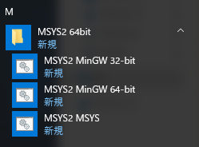
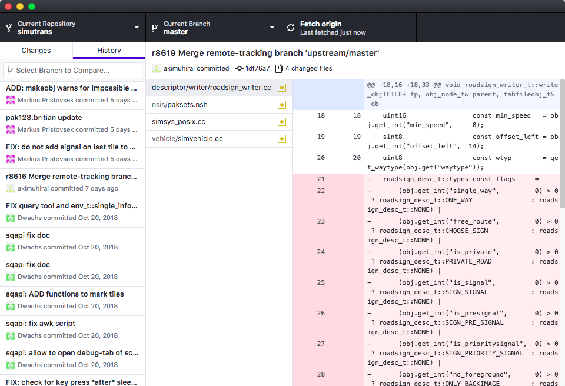

# 環境構築
本章では開発に不可欠なコンパイラ・ライブラリ・デバッガなどの整備を行う．環境整備はビギナーにとって最も大きな難関である．

なお，本章では主にwindows環境を対象として説明を行う．MacおよびLinux環境については[こちら](#windows以外の環境でのコンパイル)を参照されたい．

## リポジトリのFork

本書ではバージョン管理システムとしてgitを用いる．本家のソースコードリポジトリは https://github.com/aburch/simutrans にある．これに**Fork**という操作をして自分のリポジトリにコピーしてから使う．なお，gitやGitHubについては[git・GitHubについて](#git・GitHubについて)を参照されたい．

まずは，[GitHub](https://github.com)のアカウントを作り，それでログインする．ログインした状態で[本家リポジトリ](https://github.com/aburch/simutrans)にアクセスする．下の図のように画面右上に「Fork」というボタンが出現するので，それをクリックする．すると，自分のアカウントにSimutransリポジトリが作成される．例えばGitHubのユーザー名が`himeshi`であれば，`himeshi/simutrans` といった具合になる．


## msys2環境のセットアップ
以降はWindowsを対象とした説明である．それ以外の環境については[#windows以外の環境でのコンパイル](#windows以外の環境でのコンパイル)を参照されたい．

本書ではシェル環境としてmsys2を用いる．msys2はコマンドプロントのようなものである．以降はこのmsys2を使ってコンパイルやデバッグを行う．まずは， http://www.msys2.org/ からmsys2をダウンロードし，インストールする．ダウンロードボタンはサイトの上部の配置されている．Windowsが64bit版であれば， x86\_64とついたものをダウンロードしてウィザードに従ってインストールすればよい．

インストールが終われば自動的にmsys2が起動するが，これは一旦閉じる．スタートメニューからMSYS2の***32bit版***を起動する．これはSimutransのソースが公式には32bitにしか対応していないことによる．



黒いコマンドライン画面が登場するので，以下のコマンドを打ちこむ．

```sh
yes | pacman -Syu
```

すると，出力の最後の方にこのようなメッセージが表示される．

```sh
警告: terminate MSYS2 without returning to shell and check for updates again
警告: for example close your terminal window instead of calling exit
```

ウィンドウの閉じるボタンでMSYS2を閉じて，再度MSYS2を起動する．（繰り返すが32bitを起動することに注意．）

再起動したら以下のコマンドを打ち，パッケージを更新する．
```sh
yes | pacman -Su
```

つづいて，以下のコマンドをMSYS2で実行し，諸々のツールをインストールする．
```sh
pacman -S git make mingw-w64-i686-toolchain mingw-w64-i686-zlib mingw-w64-i686-bzip2 mingw-w64-i686-libpng
```

インストールするパッケージの選択を求められるので，何も入力せずEnterを押す．つまり，全てのパッケージを導入する．


## ソースコードのダウンロード
続いて，simutransの開発リポジトリをダウンロードする．先ほど本家のリポジトリをForkして「自分の」リポジトリを作成した．この自分に所有権があるリポジトリをダウンロードする．

デスクトップ上にソースコードのフォルダを作ると想定する．他のディレクトリに作る場合は適宜cdコマンドで指定するディレクトリを置き換える．
```sh
cd /c/Users/UserName/Desktop
git clone https://github.com/himeshi/simutrans.git
cd simutrans
```

1行目の`UserName`は読者のアカウントのユーザーネームに置き換える．URL中の`himeshi`は読者のGitHubユーザーネームに置き換える．これで，デスクトップ上に「simutrans」という名でソースコードフォルダが生成されたはずである．

## はじめてのコンパイル
コンパイルはmakeコマンドで行う．その前に，いくらかの設定が必要である．まずは，その設定ファイルを用意する．

適当なエディタ（TeraPadやSakuraエディタ等．Windowsのメモ帳は改行コードや文字コードの問題があるので使ってはならない．）を用いて 「`config.default`」 という名前のテキストファイルを作成する．それを，simutransソースコードのトップディレクトリに配置する．このファイルの作成は手打ちで行ってもよいし，simutransソースコードにあるconfig.templateを利用してもよい．config.defaultは以下のようにする．
```
BACKEND = gdi
COLOUR_DEPTH = 16
OSTYPE = mingw
DEBUG = 1
STATIC = 1
WITH_REVISION = 8550
WIN32_CONSOLE = 1
MULTI_THREAD = 1
USE_FREETYPE = 0
USE_UPNP = 0
MAKEOBJ_PROGDIR = $(shell pwd)
NETTOOL_PROGDIR = $(shell pwd)
PROGDIR  = $(shell pwd)
```

`WITH_REVISION`は本家におけるrevision番号である．GitHubからクローンしている関係上，適切な番号を自分でつける必要がある．（適当な番号でもローカル環境ではさしあたり問題ない．）各行の意味はconfig.templateを参照することで確認できる．

config.defaultをsimutransソースコードのトップディレクトリに置いく．そして，MSYS2上で`make`コマンドを実行し，コンパイルする．MSYS2のディレクトリがsimutransのソースディレクトリになっているか確認してほしい．（pwdコマンドで確認できる．）
```
make -j4
```

-j4というのは並列数を指定するオプションである．お使いのマシンの論理コア数を指定すると良い．（例えばデスクトップ向けi5ならたいてい論理4コアなので-j4となる．）

コンパイル出力の最後はこのようになる．
```
===> HOSTCXX music/w32_midi.cc
===> HOSTCXX sound/win32_sound.cc
===> RES simres.rc
===> LD  sim.exe
```

「`LD`」から始まる行が成功していればコンパイル成功である．このとき，simutransソースコードのトップディレクトリにsim.exeが生成されている．これを適当なSimutrans環境ディレクトリ（pakなどが入ってるところ）にコピーし，実行すればめでたく起動する．

### コンパイルに失敗したら
simutransは数多くの外部ライブラリ等に依存しているため、一発でコンパイルを通すことは容易ではない。適切にsim.exeが生成されていなければコンパイルは失敗している。コンパイルに失敗したときは、以下の順に解決を試みる。

1. 英語のエラーメッセージを解読する。例えば、
  ```sh
  Makefile:29: *** Unkown OSTYPE "", must be one of "amiga beos freebsd haiku linux mingw mac openbsd".  Stop.
  ```
  というエラーは、OSTYPEがUnknownですと書いてあるので、config.defaultでOSを指定し忘れたことによるエラーだとわかる。
1. エラーメッセージをgoogle検索する。似たようなエラーに苦しんだ先人は意外に多い。
1. twitterや日本語フォーラム・本家フォーラムで相談する。このとき、手元に出ているエラーメッセージやログをすべて提供し、エラーが出るまでに踏んだ手順をすべて説明することが問題解決への近道である。

エラーを目の前にすると絶望感に襲われがちだが、ぜひ諦めずに問題解決に取り組んでほしい。

### config.defaultについて
ソースディレクトリの中を見ると，Makefileという名のファイルがある．MSYS2で実行されたmakeコマンドはMakefileを読んでコンパイルを行う．

ところで，SimutransはWindows，mac，Linux，さらにはBeOSもと様々な環境でコンパイルできるようになっている．Makefileでこれらの変数を定義するのは大変なので，Makefileがconfig.defaultをインポートして，環境変数として使用するのである．これにより，複雑なMakefileを編集することなく，config.defaultを編集するだけで様々な条件下でのコンパイルが可能になるのである．

## デバッガで動かす
めでたくexeファイルを生成できた．このexeファイルをダブルクリックでそのまま実行しても動作はする．しかし，この実行方法ではこの先の開発で必要になる種々のデバッグ出力を得ることができない．そこで，開発を行うときは必ず「gdb」というデバッガ上でsimutransを動かすことになる．

生成したexeファイルをsimutrans実行ディレクトリにコピーの上，cdコマンドでそこに移動する．例として，simutrans実行ディレクトリをEドライブのsim\_testフォルダにしているとすると，gdbでsimutransを走らせる手順は以下のようになる．

```sh
cd /e/sim_test
gdb sim.exe
GNU gdb (GDB) 8.1.1
（中略）
Reading symbols from sim.exe...done.
(gdb) r
Starting program: E:\sim_test\sim.exe
（下に続く）
```

「gdb sim.exe」でgdbがsim.exeを準備する．準備ができたら，「`r`」（run の意味）で起動する．こうすることで，バックトレースなどの貴重なデバッグ情報を得ることができる．

## ワークフローの自動化
結局のところ，開発のワークフローは以下のようになる．
1. コードを編集する
1. makeする
1. 生成されたexeファイルをsimutrans実行ディレクトリにコピー
1. gdbを立ち上げる
1. gdb内でrunする

これをイチイチやるのはあまりに面倒であるから，せめて2〜4は自動化しよう．
そのためには，下のようなファイルを作成すればよい．

```sh
echo "r:just run with gdb"
echo "c:compile and run"
read C
if [ "$C" == "c" ]
then
	cd /c/Users/Himeshi/Desktop/simutrans
	make -j4
	cp sim.exe /e/sim_test/
fi
gdb /e/sim_test/sim.exe
```

各パスは各自の環境に応じて変更してもらいたい．まず，「`chmod u+x sim.sh`」 で実行権限を付与する．その後，「`./sim.sh` 」でスクリプトを実行する．すると，コンパイルをするかしないか問われるので，する場合は`c`を入力，しない場合は`r`を入力すれば，gdbの立ち上げまで自動で行われる．

## windows以外の環境でのコンパイル
MacやLinuxでの環境構築はWindowsよりも簡単である．
### Ubuntuでのコンパイル
先の節で説明したように，予めGitHubで本家のリポジトリをForkしておく．次に，config.defaultを適当な場所に用意する．このファイルは手打ちしてもよいし，simutransソースコードに含まれているconfig.templateを利用してもよい．ここで作成したconfig.defaultはあとでスクリプトで適切な位置にコピーする．
```
BACKEND = sdl2
COLOUR_DEPTH = 16
OSTYPE = linux
DEBUG = 3
OPTIMISE = 1
WITH_REVISION = 8550
MULTI_THREAD = 1
MAKEOBJ_PROGDIR = $(shell pwd)
NETTOOL_PROGDIR = $(shell pwd)
PROGDIR  = $(shell pwd)
```

次に，先ほど作成したconfig.defaultと同じディレクトリにシェルスクリプトファイルを作る．このシェルスクリプトで必要なライブラリをインストールし，ソースコードをクローンし，コンパイルを行う．ファイル名は適当にsetup.shとでもしておく．

```sh
sudo apt install make gcc gdb git zlib1g-dev libbz2-dev libpng-dev libsdl2-dev libminiupnpc-dev libfreetype6
cd ~/
git clone https://github.com/himeshi/simutrans.git
cd ~/simutrans
cp $(cd $(dirname $0);pwd)/config.default ~/simutrans
make -j2
```

例によって4行目の「`himeshi`」の部分は各自のgithubアカウントに置き換えてほしい．
あとは，このシェルスクリプトを実行
```sh
chmod u+x setup.sh
./setup.sh
```
すると，ソースコードのトップディレクトリに「sim」という名前の実行ファイルが生成されているはずである．

### Macでのコンパイル
先の節で説明したように，予めGitHubで本家のリポジトリをForkしておく．

まず，Homebrewをインストールする．ターミナルを開き，以下のコマンドを入力する．このコマンドは手打ちするのではなく，[Homebrewのwebページ](https://brew.sh/index_ja)からコピペすると良い．
```sh
/usr/bin/ruby -e "$(curl -fsSL https://raw.githubusercontent.com/Homebrew/install/master/install)"
```

Homebrewのインストールが終わったら，ライブラリをインストールする．引き続き，ターミナル画面で以下のコマンドを入力する．
```sh
brew install sdl2 libpng miniupnpc freetype
```

続いて，config.defaultを作成する．適当なエディタを開き，以下のテキストの通りにする．このファイルの作成は手打ちで行ってもよいし，simutransソースコードにあるconfig.templateを利用してもよい．「config.default」という名前でこのファイルをデスクトップに保存する．

```
BACKEND = sdl2
COLOUR_DEPTH = 16
OSTYPE = mac
DEBUG = 3
OPTIMISE = 1
WITH_REVISION = 8550
MULTI_THREAD = 1
MAKEOBJ_PROGDIR = $(shell pwd)
NETTOOL_PROGDIR = $(shell pwd)
PROGDIR  = $(shell pwd)
```

最後に，simutransソースコードをクローンし，コンパイルを行う．ターミナル画面で以下のコマンドを実行する．URLの「`himeshi`」の部分は，読者のGitHubアカウント名に置き換える．

```sh
cd ~/
git clone https://github.com/himeshi/simutrans.git
cp ~/Desktop/config.default /simutrans
cd ~/simutrans
make -j4
```

これで，Macのホームディレクトリ直下にsimutransというフォルダが生成されている．さらに，その中に「sim」というファイル名で実行ファイルが生成されたはずである．実際に動かすときは，simをsimutrans実行ディレクトリ（pakファイルなどが入っている場所）にコピーした上で，ターミナルで

```sh
cd <simが配置された場所>
./sim
```
と入力すれば起動する．simファイルをダブルクリックすることでも起動することができる．

#### ワークフローの自動化
WindowsやLinuxではデバッガとしてGDBを用いるが，Macではそれと同等のものとしてLLDBが用意されている．よって，開発を行うときはLLDB上でsimutransを動かすことになる．コードの場所を`~/simutrans`（`~/`は「ホームディレクトリ直下の」という意味である），テスト環境の場所を`~/sim_test`とすれば，make→コピー→lldbで起動の流れは下のようなスクリプトになるだろう．

```sh
echo "r:just run with gdb"
echo "c:compile and run"
read C
if [ "$C" == "c" ]
then
	cd ~/simutrans
	make -j4
	cp sim ~/sim_test
fi
lldb ~/sim_test/sim
```

lldbが起動すると下のように「`target create "sim"`」と表示される．ここで，「`r`」（run の意味）と入力すればsimutransが起動する．
```sh
(lldb) target create "sim"
Current executable set to 'sim' (x86_64).
(lldb) r
```

## git・GitHubについて
Simutransは巨大なコードベースであり，不特定多数の人がコードを編集する．このような状況下では，複数人が同時にファイルを編集してその結果が衝突したり，一度行った変更をもとに戻す必要があったり，誰がどんな変更をしたか記録しておく必要があったりといったことが発生する．これらへの解決策がバージョン管理システムである．SimutransではSubversion（通称svn）というバージョン管理システムを採用している．

しかし，バージョン管理システムにおける世間の主流はgitである．特に，外部からプロジェクトに貢献しようとする者にとっては，バージョン管理システムのgitとそのクラウドサービスであるGitHubが圧倒的に便利である．このような状況であるから，simutransでは[GitHub上にsvnリポジトリのミラー](https://github.com/aburch/simutrans)を提供している．我々はそのミラーを本家リポジトリとして使うのである．

gitやGitHubについて詳しく学びたい場合は，[『サルでもわかるGit入門』](https://backlog.com/ja/git-tutorial/)がオススメである．このサイトは，コミットやブランチなどといった重要な概念をわかりやすく説明している．Gitのチュートリアルはコンソールを使って行うのが望ましい．

### GitHub Desktopの導入
gitにまつわる種々の操作をコマンドライン上で行うのは初学者にはややハードルが高い．そこで，gitのGUIクライアントであるGitHub Desktopを紹介する．https://desktop.github.com/ からダウンロードしてインストールしてほしい．GitHubアカウントでサインインする．「File」→「Add Local Repository」で，環境構築時にダウンロードしたsimutransソースコードの場所を選択すれば，GitHub Desktopでコードの管理を行えるようになる．



## 起動オプション
simutransには種々の起動オプションが用意されている．用意されている起動オプションは
```sh
./sim.exe -help
```
で確認することができる．（Windows環境以外ではexeはつかない．）

よくある開発シチュエーションで，テスト環境には複数のpakがインストールされており，「pak128」を「addonを含めて」読み込み，「test.sve」をロードするというケースがあるだろう．この時，次のようなオプションをつけて起動すればpakの選択やセーブデータの読み込みを全自動で行うことができる．
```sh
./sim.exe -objects pak128 -addons -load test.sve
```

起動オプションを毎回入力するのは手間であるから，起動スクリプトに追記すると楽である．デバッガには予め起動オプションを渡す機能があり，gdbで次のようにしてデバッガを起動すれば，「run」の「`r`」をデバッガ内で入力するだけで起動オプション付きで起動することができる．

```sh
gdb --args sim.exe -objects pak128 -addons -load test.sve
```

lldbの場合は次のようになる．

```sh
lldb -- sim -objects pak128 -addons -load test.sve
```

## 本章で参考になるところ 
* http://text.baldanders.info/remark/2016/03/gcc-msys2-2/
* https://qiita.com/Aruneko/items/373ed7d135b6f686dbd9
