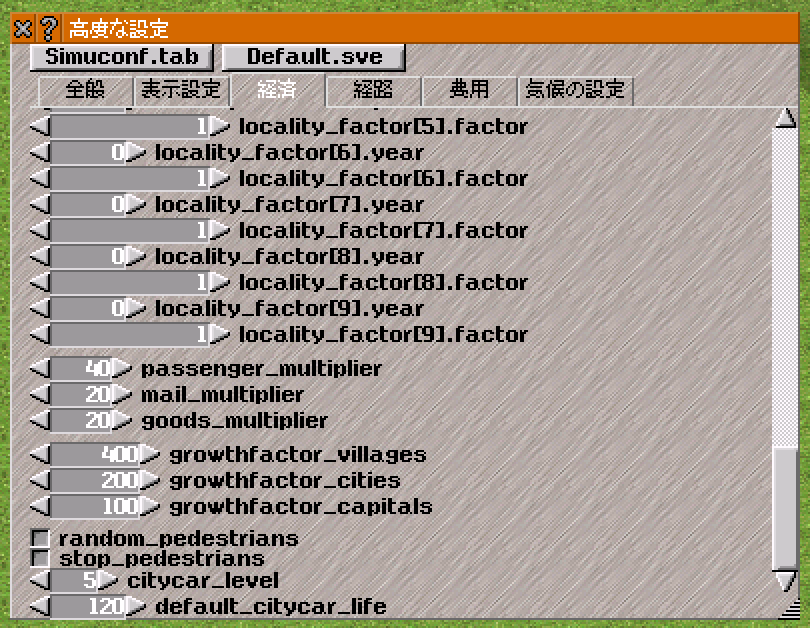

## 改造1: 一定制限速度以上の道路は市道化しない

それでは，1つめのやり方で改造に取り掛かるとしよう．後ろにもう一つの改造が控えているので，gitで適当にブランチを切ってから作業することを勧める．コマンドラインでは下のコマンドを実行すれば，「`speed_threshold`」という名前のブランチを作成し，同時にそのブランチに切り替えることができる．

```
git checkout -b speed_threshold
```

今から行う改造は，「一定制限速度以上の道路であれば市道化しない」というものである．速度の閾値はユーザーが自由に決められるようにすべきである．しかし，いきなり一般論から入ると難しいので，まずは60km/h以上の道路は市道化しないことにしたい．どうすればいいのだろうか？考えて手を動かして実験してみよう．

----

一例として，`update_city_street`を以下のように編集してみる．
```c++
bool update_city_street(koord pos)
{
	const way_desc_t* cr = world()->get_city_road();
	for(  int i=0;  i<8;  i++  ) {
		if(  grund_t *gr = world()->lookup_kartenboden(pos+neighbors[i])  ) {
			if(  weg_t* const weg = gr->get_weg(road_wt)  ) {
				// Check if any changes are needed.
				if(  (!weg->hat_gehweg()  ||  weg->get_desc() != cr)  &&  weg->get_max_speed()<60  ) {
          // 市道化する
					player_t *sp = weg->get_owner();
					if(  sp  ){
						player_t::add_maintenance(sp, -weg->get_desc()->get_maintenance(), road_wt);
						weg->set_owner(NULL); // make public
					}
					weg->set_gehweg(true);
					weg->set_desc(cr);
（以下省略）
```
8行目に注目すると，if文の条件に「`weg->get_max_speed()<60`」が追加された．これで，道路の制限速度が60km/hより小さいときのみ市道化が実行される．

### settings\_t
それでは，この「60km/h」を一般化しよう．simutransではゲームのパラメータはセーブデータ内に保存することになっている．パラメータ設定のためにsimuconf.tabを参照するのは初回起動時だけというのが原則である．これは，ネットワークゲームにおいてsimuconf.tabの違いが挙動に影響を及ぼすことを防ぐためである．

simutransではこの「setting」を扱うクラスが用意されている．それはdataobj/settings.hに書かれている`settings_t`である．お手元の環境でdataobj/settings.hを開いてほしい．

settings.hには「高度な設定」で見覚えのあるパラメータたちがたくさん並んでいることがわかる．`settings_t`はパラメータを専門に扱うクラスである．ヘッダファイルは各パラメータに対して下のコードのような構成で書かれている．

```c++
private:
  sint32 traffic_level;
public:
  sint32 get_traffic_level() const { return traffic_level; }
  void set_traffic_level(sint32 l) { traffic_level=l; }
```
パラメータがprivate属性で用意され，public属性でそのgetter・setter関数が用意されている．変数自体をprivateにして外部から変数にアクセスする時はgetter・setterを使うという仕組みは，オブジェクト指向プログラミングの定石である．

それでは，ここにパラメータを追記しよう．「制限XXキロ以上なら市道化しない」という値なので，`max_cityroad_speed`という名前にしてみる．すると，`settings_t`のヘッダファイルに，次のように書き足せばいいことになる．

```c++
private:
  uint16 max_cityroad_speed;
public:
  void set_max_cityroad_speed(uint16 l) {max_cityroad_speed=l;}
  uint16 get_max_cityroad_speed() const {return max_cityroad_speed;}
```
`weg_t`において`max_speed`がuint16で定義されているのでここでも変数サイズをuint16とした．そして，simcity.ccの`update_city_street()`において，下のコードのように「60km/h」を`max_cityroad_speed`に置き換えてあげればよい．

```c++
bool update_city_street(koord pos)
{
	const way_desc_t* cr = world()->get_city_road();
	for(  int i=0;  i<8;  i++  ) {
		if(  grund_t *gr = world()->lookup_kartenboden(pos+neighbors[i])  ) {
			if(  weg_t* const weg = gr->get_weg(road_wt)  ) {
				// Check if any changes are needed.
        uint16 threshold = world()->get_settings().get_max_cityroad_speed();
				if(  (!weg->hat_gehweg()  ||  weg->get_desc() != cr)  &&  weg->get_max_speed()<threshold  ) {
          // 市道化する
					player_t *sp = weg->get_owner();
（以下省略）
```
8行目で閾値速度をローカル変数`threshold`として用意し，9行目でそれを使っている．`world()->get_settings()`で`settings_t`オブジェクトを取得できる．ここで取得されるのは参照型なので，メンバ関数にはアロー演算子ではなくドットでアクセスする．

さて，未だ2つの問題が残っている．

* `max_cityroad_speed`をユーザーが設定する手段がない．
* `max_cityroad_speed`がセーブデータに保存されていない．

1つめの問題は次節で対処するとして，2つめの問題を片付けてしまおう．

先ほど編集したのはsettings.hであった．ディレクトリをよく見るとsettings.ccなるファイルも存在する．今からsettings.ccで行う作業は「初期化」「simuconfのパース」「データのセーブ」である．お手元のdataobj/settings.ccを開いて一緒に作業を進めていこう．

まず`settings_t`のコンストラクタである`settings_t::settings_t()`で初期化を行う．下のコードの7行目がそれである．適当にコンストラクタの末尾にでも書き足しておけばよかろう．（r8549現在ではdataobj/settings.ccの300行目前後）
```c++
  random_counter = 0;	// will be set when actually saving
	frames_per_second = 20;
	frames_per_step = 4;
	server_frames_ahead = 4;
  
  // テキトーに60km/hで初期化すればいいかな
  max_cityroad_speed = 60;
}
```

次に，simuconf.tabを読み込む．これは`settings_t::parse_simuconf()`が行うので，その中に追記してあげる．これも関数末尾に近い位置に追記すればよい．（下のコードの5行目）ちなみに，`contents.get_int()`の第二引数はsimuconf.tabから該当パラメータが見つからなかったときの初期値である．`max_cityroad_speed`はコンストラクタで既に初期化してあるので第二引数には設定するパラメータ自身を使う．
```c++
  max_ship_convoi_length = contents.get_int("max_ship_convoi_length",max_ship_convoi_length);
  max_air_convoi_length = contents.get_int("max_air_convoi_length",max_air_convoi_length);

  // simuconf.tab内の"max_cityroad_speed"という項目を読む
  max_cityroad_speed = contents.get_int("max_cityroad_speed", max_cityroad_speed);

  // Default pak file path
  objfilename = ltrim(contents.get_string("pak_file_path", "" ) );
  printf("Reading simuconf.tab successful!\n" );
}
```

これで，simuconf.tabからパラメータをセットできるようになった．simuconf.tabに「`max_cityroad_speed=80`」と追記して，起動してみよう．制限速度80km/h以上の道路が市道化しなくなっていることを確認してほしい．

以上で「一定制限速度以上の道路は市道化しない」改造は達成されたように見える．実際，私的な範囲で使う分にはあまり問題はない．しかし，本家統合などが目的の場合は，本節の冒頭で述べた理由によりパラメータ`max_cityroad_speed`をセーブデータ内に保存する必要がある．そこで，次節ではセーブデータの読み書きを行う．

### セーブデータの読み書き}
セーブデータの読み書きは`settings_t::rdwr()`で行う．なお，`grund_t`や`weg_t`や`vehicle_t`などといったあらゆるクラスに`rdwr()`関数は用意されており，そこでデータの読み出し・保存を行うことになっている．ロード・セーブで別々の関数が用意されているのではなく，ロード時・セーブ時ともに`rdwr()`関数が呼ばれることに注意されたい．ここで，`settings_t`の`rdwr()`の一部を覗いてみよう．

下のコードはdataobj/settings.ccの`settings_t::rdwr()`の一部であり，`settings_t`の`bonus_basefactor`という変数の値を読み書きしている．
```c++
if(  file->get_version()>=111002  ) {
  file->rdwr_long( bonus_basefactor );
}
else if(  file->is_loading()  ) {
  // 古いバージョンなので読み出しせず125という値を代入する．
  bonus_basefactor = 125;
}
```
1行目でバージョンチェックをしている．この場合，バージョンが111002以上であれば読み書き，それ以前であれば読み書きせず値を代入している．2行目にある`rdwr_long()`は32bitのパラメータを読み書きする場合に使い，64bitの場合は`rdwr_longlong()`，16bitの場合は`rdwr_short()`，8bitの場合は`rdwr_byte()`を使う．bool値の場合は`rdwr_bool()`を使う．ここで引数に渡しているのは参照であって（`loadsave_t`のヘッダファイルを読むとわかる．），読み出しの際は引数として渡した変数に値が格納され，書き出しの際は引数として渡した値がデータに書き込まれる．simutransではセーブデータ内に変数がindexナシに順番に格納されるので，ここで **読み書きする順番に誤りがあると処理に支障をきたす** ことに注意されたい．例えば，古いデータを読むときに誤って新しいバージョンでしか定義されていないパラメータを読み出そうとしたとする．このとき，「パラメータが見つからないからエラー」ではなく「読み出す順番がズレて処理続行不能」となるのである．

ところで，セーブデータのバージョンはどこで定義されているのだろうか．その答えはsimversion.hにある．下のコードはsimversion.h 13行目からのの抜粋である．

```c++
#define SIM_VERSION_MAJOR 120
#define SIM_VERSION_MINOR   4
#define SIM_VERSION_PATCH   1
#define SIM_VERSION_BUILD SIM_BUILD_NIGHTLY

// Beware: SAVEGAME minor is often ahead of version minor when there were patches.
// ==> These have no direct connection at all!
#define SIM_SAVE_MINOR      7
#define SIM_SERVER_MINOR    7
// NOTE: increment before next release to enable save/load of new features

#define MAKEOBJ_VERSION "60.1"
```

`rdwr()`で扱うデータのバージョン番号は **バージョン番号 = SIM_VERSION_MAJOR×1000 + SIM_SAVE_MINOR** で計算される．

各種バージョン番号が上のコードのようになっているならば，その状態でデータを保存するとバージョン番号は「120*1000+7=120007」と計算される．読み書きするパラメータを新しく増やすときは`SIM_SAVE_MINOR`の値を増やした上で`rdwr()`で適切にバージョンによる場合分けをしなければならない．

それでは，`max_cityroad_speed`のデータを読み書きしよう．まずは，simversion.hの`SIM_SAVE_MINOR`の値を増やす．お手元のコードの`SIM_SAVE_MINOR`が7ではなかった場合はお手元の`SIM_SAVE_MINOR`の値を1増やせばよい．

```c++
// もともとの値が7だったので1増やして8にする
// SIM_SERVER_MINORも増やす
#define SIM_SAVE_MINOR      8
#define SIM_SERVER_MINOR    8
```

つづいて，dataobj/settings.ccの`settings_t::rdwr()`に`max_cityroad_speed`の読み書き処理を追記する．`settings_t`オブジェクトの初期化時点で`max_cityroad_speed`は初期化されているので，バージョン番号が十分新しい場合にのみ読み書き処理をすれば十分である．適当に`settings_t::rdwr()`の末尾にでも追記しておけばよい．

```c++
if(  file->get_version() >= 120008  ) {
	file->rdwr_short(max_cityroad_speed);
}
```

### 高度な設定ウィンドウの整備}
`max_cityroad_speed`の初期化はした．simuconfのパースもした．パラメータのファイル保存もした．市道化アルゴリズムは`max_cityroad_speed`を参照するようになった．やり残したことは，ユーザーが「高度な設定」ウィンドウから`max_cityroad_speed`を編集できるようにすることである．これをやらないと，ユーザーは一度ゲームを開始したら二度とそのパラメータを変更できないことになってしまう．



高度な設定ウィンドウは図\ref{高度な設定ウィンドウ}のように，大きな外枠ウィンドウがあってその中に6つのタブが並んでいる．`max_cityroad_speed`は「経済」タブの中に配置するのが妥当であろう．というわけで，経済タブの一番下に配置することにしよう．

次に，ソースコードフォルダのguiディレクトリを眺めてみると，settings\_frame.h・.ccとsettings\_stats.h・.ccを見つけることができる．settings\_frame.hおよびsettings\_frame.ccは高度な設定ウィンドウの外枠を定義しているファイルである．settings\_stats.hおよびsettings\_stats.ccは各パラメータの設定部品を定義しており，我々が変更を加えるのはこちらである．このファイルはマクロを使って書かれており，コードを文法的にまじめに解読する意味はない．gui/settings\_stats.ccにある，`settings_economy_stats_t::init`と`settings_economy_stats_t::read`の末尾にそれぞれ次のように追記しよう．

```c++
void settings_economy_stats_t::read(settings_t* const sets)
{
  // （この間たくさんの初期化コード）
  READ_NUM_VALUE( sets->max_cityroad_speed );
}

void settings_costs_stats_t::init(settings_t const* const sets) {
  // （この間たくさんの初期化コード）
  // 引数は 表示名, 変数, min, max, 補完, wrap (通常false)
  INIT_NUM("max_cityroad_speed", sets->get_max_cityroad_speed, 0, 65535, gui_numberinput_t::AUTOLINEAR, false );

  clear_dirty();
  height = ypos;
  set_size( settings_stats_t::get_size() );
}
```
`settings_t`において`max_cityroad_speed`はprivate宣言したにもかかわらず，コードの10行目では`max_cityroad_speed`が直接アクセスされている．これは，このクラスがfriendクラス扱いになっているからである．friendクラスについては[『ロベールのC++教室』第2部第43章](url{http://www7b.biglobe.ne.jp/~robe/cpphtml/html02/cpp02043.html)を読むとよい．

これで市道化境界速度のパラメータが正しく設定できるようになり，ファイルに保存され，市道化処理に反映されるようになった．所望の結果が得られているか，各自でテストしてみよう．
