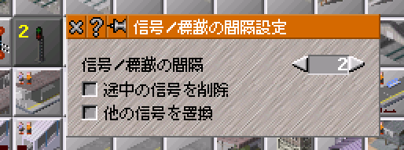
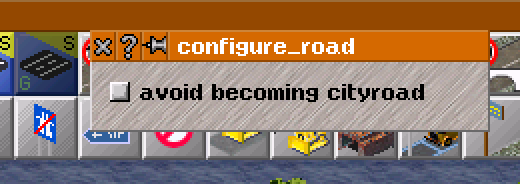

## 改造2: 市道化の可否を道路1タイルずつ設定する

２つめのアプローチは，市道化の可否を道路1タイルずつ指定する方式である．道路建設ツールをctrlキーを押しながらクリックすると，図\ref{OTRP_road_config}のように市道化防止ボタンが登場する．市道化防止ボタンが押された状態でその道路を建設すると，その道路についてのみ市道化が禁止される．

先ほどの改造とは全く別の改造になるので，gitで新しいブランチを用意しよう．コマンドラインで下のようにすれば，「cityroad\_button」という名前のブランチを作成し，同時にそのブランチに切り替えることができる．cityroad\_buttonブランチはspeed\_thresholdブランチからではなく，masterブランチから派生させることに注意されたい．

```c++
git checkout master
git checkout -b cityroad_button
```

まず，市道化の可否はどうすればいいのだろう．道路オブジェクトに市道化可否フラグを持たせて，`stadt_t::update_city_street()`の中で対象道路に市道化防止フラグが立っているか検査してから市道化処理を行えば良さそうである．道路に変数をもたせたので，それをセーブデータに保存することも必要だ．変数をセーブデータから出し入れするには`rwdr()`関数を使えばよいのであった．あとは，GUIから市道化可否フラグを設定できればよい．フラグは道路建設ツールを使って設定すると良いだろう．したがって，道路建設ツールがユーザーに対して設定ウィンドウを提供する．ユーザーが実際に道路を建設するときに，ツールが一緒に道路オブジェクトにフラグを設定すればよい．

ここまでで基本的な方針はついた．やることはもう分かっているので，あとは編集したいクラスが書かれているファイルを見つけ，編集すべき関数を見つけ，内容を理解し，コードを書き換えればよい．道路を建設するツールは何というクラスなのだろうか．クラスや関数の探し方は既に解説したとおりである．動作主体を考え，その単語で横断検索をかけ，あるいはディレクトリ構造からたどっていく．さあ，コードの海へ漕ぎ出そう．\\
\dotfill

独力での実装の旅を続けていると，このトピックではいくつかの難所に遭遇するはずである．このあとの節では，それを一つ一つ解説していこう．

### street flagとrdwrの整備}
本改造では，市道化をする時にその道路が市道化可能か判断をする．このため，道路オブジェクトに市道化可否を表すフラグ変数が必要である．まずは，道路オブジェクトに市道化可否のフラグを設け，rdwrするところまで進もう．道路オブジェクトを定義するクラスはboden/wege/strasse.hで定義されている`strasse_t`（strasseはドイツ語で道路の意味である．）である．このクラスに変数`street_flags`を定義し，そのgetter・setter関数を定義する．変数と関数をコード\ref{edit_strasse_h}のように追加する．
```c++
class strasse_t : public weg_t
{
public:
  // enumを定義
  enum { AVOID_CITYROAD = 0x01 };
  
private:
  // bool変数として定義するのではなく8bit整数として定義する
  uint8 street_flags;
  
public:
uint8 get_street_flag() const { return street_flags; }
void set_street_flag(uint8 s) { street_flags = s; }
bool get_avoid_cityroad() const { return street_flags&AVOID_CITYROAD; }
void set_avoid_cityroad(bool s) { s ? street_flags |= AVOID_CITYROAD : street_flags &= ~AVOID_CITYROAD; }

};
```
bool変数で市道化の可否を定義してもよかったのだが，あえてuint8変数として定義した．このようにすれば，後でフラグを追加するときにenumとgetter・setterの追加で済む．このテクニックはsimutransでは多数箇所で用いられている．例えば，`roadsign_desc_t`（descriptor/roadsign\_desc.h）を見ると，同じように各フラグがuint8変数1つにまとめられていることがわかる．

つづいて，boden/wege/strasse.ccを改変しよう．strasse.ccでは先ほど`strasse_t`に定義した`street_flags`を初期化し，セーブデータに読み書きできるようにする．セーブデータの読み書きは`rdwr()`関数に書けば良いのであった．`strasse_t`のコンストラクタは引数ナシのものとセーブファイルオブジェクトをとるものがあることに注意しよう．セーブファイルオブジェクトを引数に取るコンストラクタで`rdwr()`が呼ばれていることがわかる．コード\ref{strasse_cc}の5行目および14〜19行目が，boden/wege/strasse.ccにおける追記内容である．

```c++
strasse_t::strasse_t() : weg_t()
{
  set_gehweg(false);
	set_desc(default_strasse);
  street_flags = 0;
}

void strasse_t::rdwr(loadsave_t *file)
{
	xml_tag_t s( file, "strasse_t" );

	weg_t::rdwr(file);
  
  // street_flagsの読み書き
  if(  file->get_version()>=120007  ) {
    file->rdwr_byte(street_flags);
  } else {
    street_flags = 0;
  }
}
```

`street_flags`を設定したので，市道化処理を行う`update_city_street()`も`street_flags`を参照するようにする．simcity.ccにある`update_city_street()`をコード\ref{check_avoid_cityroad}のように変更する．8行目にあるif文の条件式の中に市道化可否フラグの項が追加されたことがわかるだろう．`street_flags`は`strasse_t`で定義しているので，コード\ref{check_avoid_cityroad}の6行目では道路オブジェクトを`weg_t`ではなく`strasse_t`で扱っていることに注意しよう．
```c++
bool update_city_street(koord pos)
{
	const way_desc_t* cr = world()->get_city_road();
	for(  int i=0;  i<8;  i++  ) {
		if(  grund_t *gr = world()->lookup_kartenboden(pos+neighbors[i])  ) {
			if(  strasse_t* const weg = (strasse_t*)(gr->get_weg(road_wt))  ) {
				// Check if any changes are needed.
				if(  (!weg->hat_gehweg()  ||  weg->get_desc() != cr)  &&  !weg->get_avoid_cityroad()  ) {
          // 市道化する
					player_t *sp = weg->get_owner();
（以下省略）
```

### 市道化可否を道路建設に反映}
道路オブジェクトに市道化可否フラグを設け，`update_city_street()`でそれを参照するようにした．あとは，ユーザーが市道化の可否をGUIで設定し，それが道路建設時に適切に反映されるようにすればよい．まずは，ユーザーが設定した市道化可否を道路建設に反映するようにしよう．ここでもやることは同じ．クラスを特定し，関数を特定し，内容を理解し，改変を加える．まずは自分でコードを読み，「道路建設がどのようにして行われているのか」を把握することにチャンレジしよう．\\
\dotfill

何度か述べたとおり，Simutransで道路を建設しているのは「道路建設ツール」である．ソースコードフォルダを眺めていると，simtool.hというファイルが見当たる．このヘッダファイルを開いて，眺めてみよう．`tool_remover_t`や`tool_raise_t`といったクラスの宣言が見られる．simtool.hはSimutransにおける種々のツールクラスを定義したファイルである．

この中に道路建設ツールをあらわすクラスがあるはずである．「道路」「建設」であるから，way，weg，build，construct，street，strasseなど思いつく限りの関連ワードでsimtool.hの中身を検索してみよう．すると，`tool_build_way_t`というクラスが見つかった．なお，その後ろのほうに`tool_build_cityroad`や`tool_build_bridge_t`，`tool_build_tunnel_t`といったクラスも見つけることができる．それぞれ市道，橋，トンネルの建設クラスであろう．

`tool_build_way_t`に話を戻そう．クラスの機能・性質を知るために，まずはヘッダファイルを読むのであった．25行ほどであるから一つ一つの関数についてその名前から機能を想像してみよう．例えば，`calc_route()`は道路建設ツールでルート検索をしているのだから，与えられた起点終点座標について建設ルートを計算する関数であろう．`init()`はその名の通りツールオブジェクトの初期化関数であるようだ．`do_work()`は「仕事をする」なので，実際に道路建設をする関数であると想像できる．名前やコメントだけではイマイチわからず，その内容を知りたいときは実装（.cc）ファイルを読んで中身の処理を理解しよう．

ともかく，我々は今「市道化可否を道路建設に反映」したいので，実際に道路建設をする関数`do_work()`の中身が気になる．そこで，simtool.ccにかかれている`tool_build_way_t::do_work()`を読むことにしよう．
```c++
const char *tool_build_way_t::do_work( player_t *player, const koord3d &start, const koord3d &end )
{
	way_builder_t bauigel(player);
	calc_route( bauigel, start, end );
	if(  bauigel.get_route().get_count()>1  ) {
		welt->mute_sound(true);
		bauigel.build();
		welt->mute_sound(false);
		return NULL;
	}
	return "";
}
```

コード\ref{do_work}の3行目で`way_builder_t`型の変数を生成している．その後建設ルートを計算し，ルートが有効であれば3行目で生成した`way_builder_t`型変数の`build()`を呼び出している．ここから，道路建設の実体は`way_builder_t`クラスにあることがわかった．そこで，`way_builder_t`クラスを調査しよう．`way_builder_t`のヘッダファイルはbauer/wegbauer.hである．（bauerはドイツ語でbuilderという意味であるからファイルの場所を推定するのは容易であろう．）

bauer/wegbauer.hを見ると，`way_builder_t`は多数の変数と関数を持った大きなクラスであることがわかる．このままヘッダファイルを眺めていてもナニをすればよくわからないが，とりあえずコード\ref{do_work}の7行目で呼ばれた関数`build()`は発見することができる．我々はこの処理の中身が知りたいのであるから，bauer/wegbauer.ccに書かれた`way_builder_t::build()`を読むことにしよう．この関数を読むとその中ほどにコード\ref{way_builder_build}ような記述がある．

```c++
switch(bautyp&bautyp_mask) {
  case wasser:
  case schiene:
  case schiene_tram: // Dario: Tramway
  case monorail:
  case maglev:
  case narrowgauge:
  case luft:
    DBG_MESSAGE("way_builder_t::build", "schiene");
    build_track();
    break;
  case strasse:
    build_road();
    DBG_MESSAGE("way_builder_t::build", "strasse");
    break;
  case leitung:
    build_powerline();
    break;
  case river:
    build_river();
    break;
  default:
    break;
}
```

`way_builder_t`オブジェクトの`bautyp`変数に予めwaytypeが設定されていて，それに応じて呼ばれる関数が変化する．今回は道路建設ツールの改造なので`build_road()`が呼ばれる．どうやらこの関数が道路建設の本体のようである．（ちなみに，`bautyp`はコード\ref{do_work}の4行目`calc_route`で設定されている．気になる人は`calc_route()`も読んでほしい．）

`way_builder_t::build_road()`を読んでみよう．同じくbauer/weg\_bauer.ccに記述されている．80行程度のコードであり紙面に貼ることはしないので，お手元のコードを眺めながら読み進めてほしい．冒頭で市道・undoまわりの処理をした後，予め計算した建設ルート1マスずつに対してfor文で処理を回していく．タイルが高架タイルorトンネルタイルなら処理をスキップする．既存道路をアップグレードするのか新規建設するのかで場合分けをし，それぞれについて道路オブジェクトのdescriptorを設定したりownerを設定したりしている．最後に再描画処理を呼ぶ．

simtool.hの探索から始まって，ようやく道路建設処理の全体が見えた．ここまでの流れを簡単に整理しておこう．`tool_build_way_t`が道路建設ツールであり，その`do_work()`関数が道路建設を行う．`do_work()`は`way_builder_t`に建設処理を丸投げしており，`build()`を経由して`build_road()`が呼ばれる．`build_road()`は予め設定された建設ルートにそって1マスずつ道路オブジェクトを配置し，道路オブジェクトに対して設定をしていく．

処理の全体がわかった今，ユーザーがウィンドウ経由で設定した`street_flags`（`strasse_t`で定義したのをおぼえているだろうか）を道路オブジェクトに反映させたい．`tool_build_way_t`に`street_flags`変数を設けた上で（あとでこれをGUIで編集できるようにする），改めて自分で手を動かしてコード改変にチャレンジしてみよう．\\
\dotfill

まずは，way\_builderから手を付けよう．`build()`や`build_road()`はそれ自体は引数を取らず，予めオブジェクトに設定しておいた値を読んで処理する方式である．そこで，まずは`way_builder_t`クラスに変数`street_flag`を設定する．bauer/wegbauer.hに以下のように追記することで，`street_flag`を定義し，setter関数を設ける．getter関数を定義していないのは，`tool_build_way_t`が`way_builder_t`に建設作業を投げて実際に建設を行う際に`way_builder_t`の`street_flag`を読み出す必要が無いからである．
```c++
class way_builder_t
{
private:
  uint8 street_flag;
  
public:
  void set_street_flag(uint8 a) { street_flag = a; }
};
```

次に`build_road()`でこの`street_flag`を道路オブジェクトに設定していく．道路オブジェクトに対する操作なので，位置関係的にはdescriptorを設定している行の前後あたりに書けばよいだろう．以下に一部省略した`way_builder_t::build_road()`のコードを示す．

```c++
void way_builder_t::build_road() {
  // 市道やundoまわりの処理．掲載省略．
	for(  uint32 i=0;  i<get_count();  i++  ) {
    if((i&3)==0) {
			INT_CHECK( "wegbauer 1584" );
		}

		const koord k = route[i].get_2d();
		grund_t* gr = welt->lookup(route[i]);
		sint64 cost = 0;

		bool extend = gr->weg_erweitern(road_wt, route.get_short_ribi(i));

		// 橋やトンネルの場合はstreet_flagだけアップデートする
		if(gr->get_typ()==grund_t::brueckenboden  ||  gr->get_typ()==grund_t::tunnelboden) {
      strasse_t* str = (strasse_t*)gr->get_weg(road_wt);
			str->set_street_flag(street_flag);
      continue;
		}

		if(extend) {
      // 型はweg_tではなくstrasse_tにする
			strasse_t * weg = (strasse_t*)(gr->get_weg(road_wt));

      if(gr->get_typ()==grund_t::monorailboden && (bautyp&elevated_flag)==0) {
        // 高架の場合street_flagだけアップデートする
				weg->set_street_flag(street_flag);
			}
			// keep faster ways or if it is the same way ... (@author prissi)
			else if((weg->get_desc()==desc  &&  weg->get_overtaking_mode()==overtaking_mode  &&  weg->get_street_flag()==street_flag  )  ||  keep_existing_ways  ||  (keep_existing_city_roads  &&  weg->hat_gehweg())  ||  (keep_existing_faster_ways  &&  weg->get_desc()->get_topspeed()>desc->get_topspeed())  ||  (player_builder!=NULL  &&  weg->is_deletable(player_builder)!=NULL)) {
				//nothing to be done
			}
			else {
				// we take ownership => we take care to maintain the roads completely ...
				player_t *s = weg->get_owner();
				player_t::add_maintenance(s, -weg->get_desc()->get_maintenance(), weg->get_desc()->get_finance_waytype());
				// cost is the more expensive one, so downgrading is between removing and new building
				cost -= max( weg->get_desc()->get_price(), desc->get_price() );
        // street_flagの設定
        weg->set_street_flag(street_flag);
				weg->set_desc(desc);
        // 以下省略
			}
		}
		else {
			// make new way
			strasse_t * str = new strasse_t();
			str->set_desc(desc);
      // street_flagの設定
      str->set_street_flag(street_flag);
			str->set_gehweg(add_sidewalk);
			// 以下省略
		}
		// 再描画まわりの処理．掲載省略．
	} // for
}
```

コード\ref{str_flag1}ではまず，16行目でトンネルや橋の場合について，26行目で高架の場合についても`street_flag`をアップデートするようにした．この都合でif文の構造が変わっていることに注意されたい．道路置き換えの場合は39行目，新規建設の場合は49行目でそれぞれ`street_flag`を設定している．編集したのはこの4点で，それ以外はもとのコードと同じである．

あとは，`tool_build_way_t`が`way_builder_t`に道路建設をさせるときに`street_flag`を`way_builder_t`オブジェクトに設定すればよい．`tool_build_way_t`に`street_flag`変数を設けた上で（コード\ref{flag_on_simtool_h}），`tool_build_way_t::do_work()`をコード\ref{do_work_mod}のように変更すればよいであろう．コード\ref{do_work_mod}では5行目で`street_flag`の設定を行っている．

```c++
class tool_build_way_t : public two_click_tool_t {
protected:
  uint8 street_flag = 0;
  
pubic:
  void set_street_flag (uint8 a) { street_flag = a; }
  uint8 get_street_flag() const { return street_flag; }
};
```

```c++
const char *tool_build_way_t::do_work( player_t *player, const koord3d &start, const koord3d &end )
{
	way_builder_t bauigel(player);
	calc_route( bauigel, start, end );
  bauigel.set_street_flag(street_flag);
	if(  bauigel.get_route().get_count()>1  ) {
		welt->mute_sound(true);
		bauigel.build();
		welt->mute_sound(false);
		return NULL;
	}
	return "";
}
```

### street\_flagをGUIで設定する}
道路オブジェクトに市道化防止フラグは設けた．道路建設ツールが道路オブジェクトにフラグを正しく設定できるようにもした．あとは，ユーザが市道化防止フラグをGUIで設定できるようにすればよい．我々が実現したいのは図\ref{OTRP_road_config}のようなウィンドウである．ctrlキーを押せばウィンドウがポップアップしてきて，ユーザーがその中のボタンを押せばそれが`tool_build_way_t`の`street_flag`変数に反映されればよい．そうすれば，建設時に`tool_build_way_t::do_work()`が`street_flag`を`way_builder_t`に適切に渡してくれる．

それでは，ctrlキーを押しながら道路建設ツールを呼んだときウィンドウをポップアップして市道化防止オプションボタンを表示するにはどうすればいいのだろうか？どうすればいいのかよくわからないときは，{\bf 似たようなことをやっている事例を探してきて，そこのコードをコピーする}のがスムーズな方法である．特に，GUIまわりのコードは内容を詳細に理解しようとするよりもとりあえず動いている既存のコードをコピペして使ってしまうほうが開発がスムーズに進行する．では，「ctrlキーを押しながらツールを呼ぶとウィンドウが出てきてオプションボタンを押せる」ことと似たようなことをやっているのは何だろう？



それは，図\ref{railway_sign_img}のような信号・標識の間隔設定ウィンドウである．したがって，信号・標識がどのようにしてこのような機能を実現しているのかを理解すればよい．まずは，simtool.hから信号設置ツールのクラスを見つけてみよう．signal, signといった関連ワードで検索をかけてみると`tool_build_roadsign_t`というクラスが見つかる．これが信号・標識を設置するツールである．ヘッダファイルで`tool_build_roadsign_t`を眺めてもあまりかわりばえしないので，実装ファイルを覗く必要がある．とりあえず，初期化関数っぽい`tool_build_roadsign_t::init()`をのぞいてみるとしよう．コード\ref{roadsign_init}がそれである．

```c++
bool tool_build_roadsign_t::init( player_t *player)
{
	desc = roadsign_t::find_desc(default_param);
	// take default values from players settings
	current = signal[player->get_player_nr()];

	if (is_ctrl_pressed()  &&  can_use_gui()) {
		create_win(new signal_spacing_frame_t(player, this), w_info, (ptrdiff_t)this);
	}
	return two_click_tool_t::init(player)  &&  (desc!=NULL);
}
```
7〜9行目に注目してほしい．ctrlキーが押されていたらウィンドウを作れと書いてある．そのウィンドウは`signal_spacing_frame_t`で定義されている．ctrlキーを押しながらツールをクリックしたらウィンドウが出てくるようにするには，ウィンドウクラスを定義した上でコード\ref{roadsign_init}の7〜9行目のようなコードを書けばよいことがわかった．

では，`signal_spacing_frame_t`を調査しよう．このクラスはgui/signal\_spacing.hに書かれている．まずは定石どおりにヘッダファイルを見てほしい．private修飾子の中には信号間隔や設置オプションといったこのウィンドウで編集するパラメータ，player，呼び出し元ツール，numberinputやlabel，buttonといったguiコンポーネントの宣言が並ぶ．GUI系クラスのヘッダファイルで用意すべき変数は大きく分けて「制御するパラメータ」，「player・呼び出し元ツールといった決まった変数」，そして「ウィンドウで使うguiコンポーネント」の3つである．public修飾子の中にはコンストラクタ，`action_triggered()`，ヘルプファイル名を返す関数が並ぶ．

それでは，gui/signal\_spacing.ccを調査しよう．お手元で当該ファイルを開きながら以下を読み進めてほしい．ここできちんと記述する必要がある関数はコンストラクタと`action_triggered()`の2つである．まずは`action_triggered()`の方から見てみよう．この関数は登録したguiコンポーネントに何らかのイベントが発生したとき呼ばれる関数である．`action_triggered()`には引数としてイベントを引き起こしたguiコンポーネント`komp`と，そのイベントの値が渡されてくる．今回は，値の方は使っていないので`komp`に注目すればよい．ウィンドウ内のguiコンポーネントと`komp`と比較し，一致すればそのコンポーネントに対して処理を行う．例えば，`komp == &remove_button`であれば，removeの状態を反転させ，ボタンに反映させている．最後に呼び出し元ツールに変更した値を代入している（`return true;`の1行前）．Simutransで提供されるbuttonオブジェクトはボタンを押しても勝手に状態が反転するわけではないことに注意されたい．

つづいて，コンストラクタについて調査しよう．渡されたplayer, 呼び出し元ツールなどを整理した後，各guiコンポーネントの配置処理を行っていることがわかるだろう．例えば，押しボタンの配置処理ならコード\ref{button_process}が配置処理のひとかたまりとなる．また，コンポーネント配置座標として`scr_coord cursor`がsignal\_spacing.ccの29行目で定義されている．

```c++
remove_button.init( button_t::square_state, "remove interm. signals", cursor );
remove_button.set_width( L_DIALOG_WIDTH - D_MARGINS_X );
remove_button.add_listener(this);
remove_button.pressed = remove;
add_component( &remove_button );
cursor.y += remove_button.get_size().h + D_V_SPACE;
```

コード\ref{button_process}では1行目で`remove_button`を初期化（引数としてボタンの種類，ボタン横のラベル文字列，位置を取る）している．2行目で幅を決めて，3行目listenerに登録（これによって`action_triggered()`が呼ばれるようになる）する．4行目で押されたか状態を設定し，5行目でウィンドウにguiコンポーネントを登録する．最後の6行目で配置座標のy座標をズラしている．これでボタンの配置が完了する．

以上で，信号・標識設置ツールがどのようにしてGUIによる値設定を可能にしているのかが理解できた．toolの`init()`でctrlキーが押されていたらウィンドウを生成し，ウィンドウ内ではguiコンポーネントを並べ，適切に初期化し，ボタンが押されたらそれに対して反応してユーザーが設定した値をtoolに格納する．このやりかたをそっくりそのまま`tool_build_way_t`でもやればいいのである．

なお，設置ツール初期化時に必要に応じてウィンドウを生成するだけでは，設置ツールが使われなくなったときに自動でウィンドウが消えてくれない．`tool_build_roadsign_t`には`exit()`という関数が実装されており（コード\ref{exit_function}），そこでウィンドウの破壊処理が行われている．`init()`や`exit()`の呼び出しはこの手のツール共通の親クラスである`two_click_tool_t`で書かれているので，我々は`exit()`の中にウィンドウ破壊処理を書くだけでよい．忘れずに`tool_build_way_t`にも移植しよう．

```c++
bool tool_build_roadsign_t::exit( player_t *player )
{
	destroy_win((ptrdiff_t)this);
	return two_click_tool_t::exit(player);
}
```

例によって以下の解説に入る前に，まずは自力でGUIダイアログの実装にチャレンジしてほしい．\\
\dotfill

まずは，GUI画面を記述するファイルを作ろう．先ほどの信号・標識設置の場合ではsignal\_spacing.h・.ccに相当する．ここではファイル名はroad\_config.h・.ccとする．ヘッダファイル（gui/road\_config.h）はgui/signal\_spacing.hを参考にすると以下のようになる．今回置くguiコンポーネントは市道化防止ボタンただ一つだけである．

```c++
#ifndef road_config_h
#define road_config_h

#include "gui_frame.h"
#include "components/action_listener.h"

class button_t;
class tool_build_way_t;
class player_t;

class road_config_frame_t : public gui_frame_t, private action_listener_t
{
private:
	static uint8 street_flag;
	player_t *player;
	tool_build_way_t* tool;
	button_t button;

public:
	road_config_frame_t( player_t *, tool_build_way_t * );
	bool action_triggered(gui_action_creator_t*, value_t) OVERRIDE;
	const char * get_help_filename() const { return "road_config.txt"; }
};

#endif
```

つづいて，gui/signal\_spacing.ccを参考にしてgui/road\_config.ccを書く．実装する関数はコンストラクタと`action_triggered()`の2つである．

```c++
#include "components/gui_button.h"

#include "road_config.h"
#include "../simtool.h"
#include "../boden/wege/strasse.h"

#define L_DIALOG_WIDTH (200)

uint8 road_config_frame_t::street_flag = 0;

road_config_frame_t::road_config_frame_t(player_t *player_, tool_build_way_t* tool_) :
	gui_frame_t( translator::translate("configure road") )
{
	player = player_;
	tool = tool_;
	street_flag = tool->get_street_flag();

	scr_coord cursor(D_MARGIN_LEFT, D_MARGIN_TOP);

	button.init( button_t::square_state, "avoid becoming cityroad", cursor );
	button.set_width( L_DIALOG_WIDTH - D_MARGINS_X );
	button.add_listener(this);
	button.pressed = weg->set_street_flag(street_flag);;
	add_component( &button );
	cursor.y += button.get_size().h + D_V_SPACE;

	set_windowsize( scr_size( L_DIALOG_WIDTH, D_TITLEBAR_HEIGHT + cursor.y + D_MARGIN_BOTTOM ) );
}

bool road_config_frame_t::action_triggered( gui_action_creator_t *komp, value_t)
{
	if( komp == &button ) {
    button.pressed = !button.pressed;
    if(  button.pressed  ) {
      // AVOID_CITYROADをONにする
      street_flag |= strasse_t::AVOID_CITYROAD;
    } else {
      // AVOID_CITYROADをOFFにする
      street_flag &= ~(strasse_t::AVOID_CITYROAD);
    }
    tool->set_street_flag(street_flag);
	}
	return true;
}
```

コード\ref{road_conf_cc}では`strasse_t`のenumを使うため5行目でstrasse.hをincludeしている．9行目で変数の初期化を行い，20〜25行目でbuttonの配置をしている．30行目から`action_triggered`の記述が始まり，ボタンの状態を反転した上で`street_flag`のビット演算をしている．41行目でそれを呼び出し元ツールに戻している．

`road_config_frame_t`クラスが書き上がったので，`tool_build_way_t`から呼び出してあげよう．ウィンドウを閉じるために必要な`exit()`関数は`tool_build_way_t`に実装されていない（オーバーライドされていない）ので，信号・標識と同じようにpublic属性でヘッダファイル（simtool.h）で宣言する．（コード\ref{exit_func_declare}）
```c++
bool exit(player_t*) OVERRIDE;
```

simcity.ccはコード\ref{simcity_mod}のように改変すればよい．road\_config.hを新しく作り，それを使うので1行目でincludeしている．`tool_build_way_t::init()`の中にウィンドウ作成処理を記した．`exit()`関数も新しく`tool_build_way_t`に実装（15行目以降）した．
```c++
#include "gui/road_config.h"

bool tool_build_way_t::init( player_t *player )
{
	two_click_tool_t::init( player );
  if (is_ctrl_pressed()  &&  can_use_gui()) {
    create_win(new signal_spacing_frame_t(player, this), w_info, (ptrdiff_t)this);
  }
  
  if( ok_sound == NO_SOUND ) {
    ok_sound = SFX_CASH;
  }
（以下省略）

bool tool_build_way_t::exit( player_t *player )
{
	destroy_win((ptrdiff_t)this);
	return two_click_tool_t::exit(player);
}
```

これでウィンドウから市道化可否をON/OFFできるようになり，我々の目的は達成された，はずである．最後に，simversion.hの`SIM_SAVE_MINOR`を忘れずに1増やしておこう．（`strasse_t`の`rdwr()`で使ったバージョン番号と合っているか確認する．詳しくは第\ref{セーブデータの読み書き}節を参照されたい．）

ところが，嬉々としてコンパイルを実行すると残念ながら次のエラーに出くわすであろう．

```c++
===> LD  /Users/XXXX/sim
Undefined symbols for architecture x86_64:
  "road_config_frame_t::road_config_frame_t(player_t*, tool_build_way_t*, bool)", referenced from:
      tool_build_way_t::init(player_t*, bool) in simtool.o
ld: symbol(s) not found for architecture x86_64
clang: error: linker command failed with exit code 1 (use -v to see invocation)
make: *** [/Users/XXXX/sim] Error 1
```

symbols not found，つまり，コンパイラが「road\_config\_frame\_tとか知りません」と怒っている．これはさきほど作成したroad\_config.ccがMakefileに登録されておらず，このファイルに対するコンパイルが行われていないからである．よって，road\_config.ccをコンパイルするようMakefileに追記しなければならない．

simutransソースコードディレクトリのトップ層にMakefileというファイルがあるので，それを開くとおよそ200〜500行目にわたってコード\ref{コンパイル対象ファイルの追加}
```c++
SOURCES += gui/convoi_filter_frame.cc
SOURCES += gui/convoi_frame.cc
SOURCES += gui/convoi_info_t.cc
SOURCES += gui/convoy_item.cc
```
のように，ccファイルたちがコンパイル対象として追加されている．よって，road\_config.ccをコンパイル対象として追加するためにはMakefileの適当な場所に
```c++
SOURCES += gui/road_config.cc
```
と追記すればよい．これでコンパイルが通ったはずだ．起動してctrlキーを押しながら道路建設アイコンをクリックすれば，図\ref{simple_conf_window}のようなウィンドウで市道化をコントロールできるはずである．



### ネットワークゲーム対応}
先の節でこの改造は一応の完成を見た，ということになった．しかし，実はこのままの状態で世の中にリリースするとユーザーから不具合報告が来ることになる．現時点で残っている不具合は以下の２つである．

* 市道化防止が原理的に不要なはずの高架で市道化可否選択ダイアログが表示される．
* ネットワークゲームでこの機能を使うと市道化防止が有効にならない．

1つめの問題はさほど深刻ではないので放置するとして，ネットワークゲームで市道化防止が機能しないのは大きな問題である．しかし，どうしてこのようなことになってしまったのだろうか．バグを調査して，修正しよう．今回の不具合はネットワークゲームでの不具合である．ネットワークゲームのデバッグをするにはローカルでサーバとクライアントを建てればよい．サーバーは`-server`オプションをつけてsimutransを起動し，クライアントは接続先に`127.0.0.1`（ローカル・ループバック・アドレス）を指定すればよい．

そもそも`tool_build_way_t::do_work()`で`street_flag`は正しく設定されているのだろうか．それを調べるところから始めよう．`tool_build_way_t::do_work()`の5行目（`street_flag`を設定している行．コード\ref{tool_break_point}を参照のこと）にブレークポイントを仕掛ける．（例：その行がsimtool.ccの2438行目であれば，`b simtool.cc:2438` とgdbに入力）
```c++
const char *tool_build_way_t::do_work( player_t *player, const koord3d &start, const koord3d &end )
{
	way_builder_t bauigel(player);
	calc_route( bauigel, start, end );
	bauigel.set_street_flag(street_flag);
  if(  bauigel.get_route().get_count()>1  ) {
		welt->mute_sound(true);
		bauigel.build();
```

ブレークポイントを設定したら「`r -server`」でsimutransを起動．市道化防止を有効にして道路を建設してみよう．道路を建設するとブレークポイントに当たってsimutransがフリーズし，gdbが入力を受け付けるようになる．ここで`street_flag`の値を出力してみよう．コード\ref{市道化防止を有効にしたのに}のようにデバッガで`street_flag`を出力させると，市道化防止を有効にしたはずなのになんと`street_flag`は0だと表示された．

```c++
(gdb) p street_flag
(uint8) $0 = '\0'
```

なるほど．では，ctrlキーを押して出てくるあのウィンドウから`street_flag`がきちんと設定されていなかったのではないか．もしくは外部から`street_flag`が0に書き換えられたのではないか．そこで，`tool_build_way_t::set_street_flag()`にコード\ref{observe_street_flag}の3行目のようにprintf文を仕込む．これで，外部から`street_flag`が操作されれば，それはprintf文によって出力されることになる．
```c++
class tool_build_way_t : public two_click_tool_t {
  void set_street_flag(uint8 a) {
		printf("flag:%d\n", a);
		street_flag = a;
	}
};
```
ところが，これをコンパイルしネットワークモードで実行し，ウィンドウから市道化防止フラグをONにして道路を建設してもコンソール画面にはコード\ref{不審な操作は見られない}のように出力される．すなはち，`tool_build_way_t`の`street_flag`はただ一度「1」に変更されただけという結果である．
```c++
flag:1
```

`tool_build_way_t`の`street_flag`はたしかに設定ウィンドウによって正しく1になった．しかし，`do_work()`の段階では0になってしまう．外部からの値操作がないとすると，`tool_build_way_t`で値が書き換えられたのだろうか？そうアタリをつけて原因箇所を探ってみても，残念ながら手がかりは得られない．ここで発想の転換が必要である．市道化防止設定ウィンドウを扱っている`tool_build_way_t`オブジェクトと，`do_work()`を実行している`tool_build_way_t`オブジェクトは，実は別モノなのではないかと．

そこで，それぞれのオブジェクトのメモリ上のアドレスを見てあげることにしよう．これもprintfで見てあげればよい．`set_street_flag()`において先ほど設定値をprintf出力したが，オブジェクトアドレスも追加で出力する．（コード\ref{オブジェクトのアドレス表示}）

```c++
class tool_build_way_t : public two_click_tool_t {
  void set_street_flag(uint8 a) {
		printf("flag:%d, addr:%d\n", a, this);
		street_flag = a;
	}
};
```

同時に`do_work()`を実行しているオブジェクトのアドレスも出力する．
```c++
const char *tool_build_way_t::do_work( player_t *player, const koord3d &start, const koord3d &end )
{
	printf("do_work: addr:%d\n", this);
	way_builder_t bauigel(player);
	calc_route( bauigel, start, end );
（以下省略）
```

これをコンパイルし，ネットワークモードで起動して市道化防止を設定し道路建設を行うと以下の結果を得る．
```c++
flag:1, addr:11225504
do_work: addr:719768224
```

２つのアドレスは異なっている．すなはち，市道化防止設定ウィンドウ経由で`street_flag`を編集したオブジェクトと，`do_work`を実行しているオブジェクトは別モノなのである．だから，`do_work`を実行すると`street_flag`の変更は反映されなかったのだ．

ちなみに，ローカルゲームの場合はこの2つのアドレス出力は一致する．オブジェクトが一致しているので`street_flag`は正しく設定されていたのである．実は，ネットワークゲームで道路建設をするとき，クライアントは道路建設コマンドを発行しているだけである．サーバーはクライアントの発行したコマンドをネットワークごしに受け取り，`do_work()`を実行したらその結果を全てのクライアントに配信しているのである．市道化防止設定ウィンドウを扱っていた`tool_build_way_t`オブジェクトはクライアント側のオブジェクト，`do_work()`を実行したオブジェクトはサーバー側のオブジェクトなのである．一般に，ネットワークゲームではユーザーの相手をするツールオブジェクトと実際に動作を行うツールオブジェクトは別モノである．

これではツールが何かしらのパラメータを使って作業を行おうとしても，それを実行するオブジェクトに情報が伝わらないので困ってしまう．そこで，simutransでは`rdwr_custom_data()`という関数が用意されている．これは親クラス`tool_t`が提供している関数であり，セーブデータ読み書きの`rdwr()`のようにこの中でネットワーク越しにパラメータを読み書きする関数である．`rdwr_custom_data()`は`tool_build_way_t`ではオーバーライドされていないが，`tool_build_bridge_t`ではオーバーライドされているのでこれを真似て実装しよう．

ヘッダファイルで`rdwr_custom_data()`を宣言し，実装ファイルで実装してあげればよい．それぞれコード\ref{rdwr_custom_data_h}と\ref{rdwr_custom_data_cc}のように追記する．これでめでたくネットワークゲームでも機能するようになった．
```c++
class tool_build_way_t : public two_click_tool_t {
  void rdwr_custom_data(memory_rw_t*) OVERRIDE;
};
```

```c++
void tool_build_way_t::rdwr_custom_data(memory_rw_t *packet)
{
	two_click_tool_t::rdwr_custom_data(packet);
	uint8 i = street_flag;
	packet->rdwr_byte(i);
	street_flag = i;
}
```

tool系の開発をするときはこのようにネットワークゲームでも所望の動作をするか細心の注意を払って開発する必要がある．
