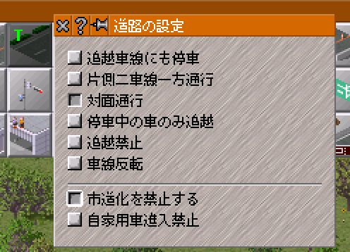
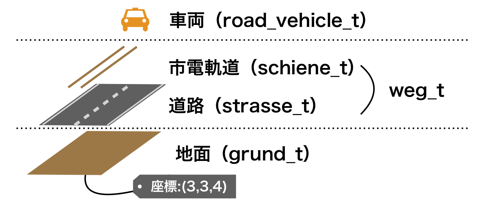
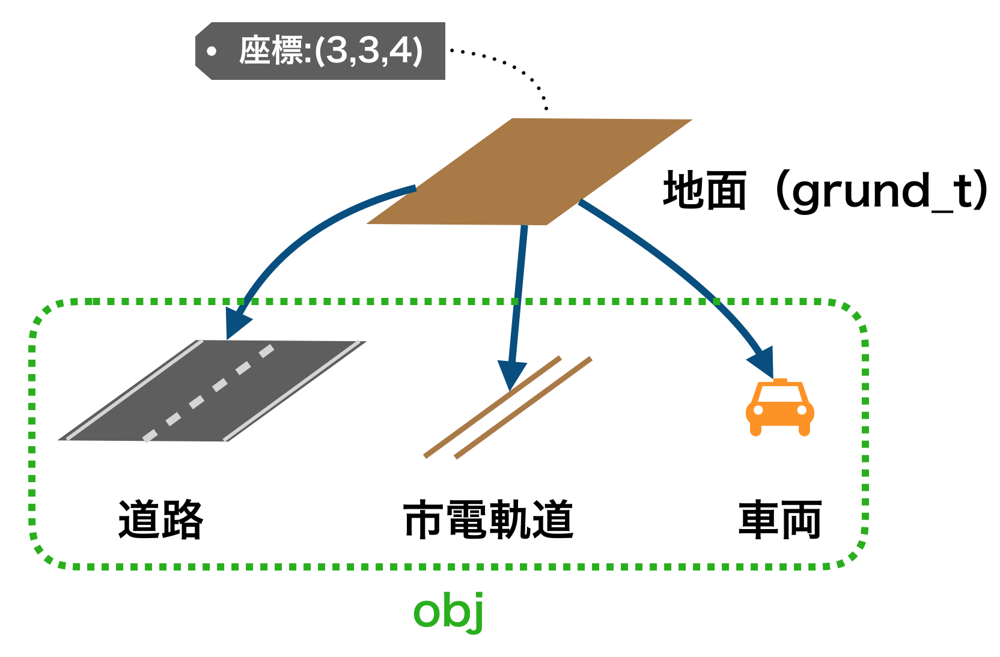

[トップページに戻る](https://teamhimeh.github.io/simdev_intro/index.html)

# ケース・スタディー 市道化防止
本章では，ケース・スタディーとして市道化防止機能の開発に取り組む．読者は実際に手を動かして市道化防止機能の開発に取り組むことによって，大規模ソフトウェアの手探りかたや，頻出の処理であるファイルの読み書き，GUIウィンドウ作成などを習得することができる．
## 本章のゴール
simutransでは都市の発展により市内建築物が建設された場合，隣接する道路は市道にする仕組みがある．これは欧州の道路事情には非常にマッチしているが，大した歩車分離もナシに車が60km/hを超えるスピードで走る日本にはなじまない機能である．


そこで，本章ではこの市道化を防止する機能の開発を行う．しかし，単純に市道化の機能を完全にナシにしてしまうのでは趣がない．Simutransのシステムとして市道化が適切な役割を演じられるように，以下の2つの方法で市道化を制御しよう．

* 制限速度が一定以上の道路は市道化しないようにする．例えば，70km/h制限の幹線道路は市道化するが，100km/h制限の高速道路は市道化しないようにする．閾値（制限何km/h以上で市道化を防止するか）はsimconf.tabおよび高度な設定から編集可能として，セーブデータに保存する．
* 道路1タイル単位で市道化を制御する．GUIウィンドウで市道化に関するフラグを設け，道路建設時にユーザーが選択できるようにする．ちょうどOTRPにおける道路の設定のイメージである．（下図）




「市道化防止」という一つの目的のためにわざわざ2つの異なるアプローチを取るのは冗長に感じられるかもしれない．しかし，この2つの実装方法を学ぶことで，読者が自分でsimutrans本体改造をするときに必要となるかなりの知識を得ることができる．ぜひ，自分で手を動かし，じっくり考えながらこのチュートリアルを進めていってほしい．

<!--
## サンプルコードについて
先に挙げた2つのアプローチについて，\ref{改造1}節では1つ目の方法で，\ref{改造2}節では2つ目の方法で改造を行う．本書では読者の利便のため，この2つの改造それぞれについてサンプルコードを提供する．サンプルコードはsimutrans standard nightly r8635を改造したものである．サンプルコードは以下のURLから参照できる．

  * [改造1（\ref{改造1}節）] \url{https://github.com/teamhimeh/simutrans/tree/intro_of_sim_dev_1}
  * [改造2（\ref{改造2}節）] \url{https://github.com/teamhimeh/simutrans/tree/intro_of_sim_dev_2}
-->

## 市道化処理の場所特定
さて，実装方針は決まったわけであるが，そもそも「どこ」に市道化処理が書かれているのだろうか．市道化処理が書かれている場所を特定できれば，そこを変更することで市道化の挙動を変更できることになる．

100行ほどの小さなプログラムであれば，main関数からがんばって処理の流れを追うことでプログラム全体を理解することは難しくない．しかし，simutransのコードベースは数万行（数十万行？）と巨大である．よって，main関数から全てをたどっていくなんてことは到底不可能である．

simutransのような大規模なソフトウェアに手を加える時，一般には下記の手順を踏む．

1. どのファイルをいじれば良いのか見つける．すなはち，改造したい機能が書かれたファイルを見つける．
1. どのclassが関与しているのか見つける．
1. 機能を改造するために必要な関数をclass内から見つける．
1. その関数が行っている処理を理解する．
1. 実際にその関数を書きかえてみる．

それでは，この手順に従って，改造するファイル・クラスを見つけるところから始めよう．

### ファイル・クラスを見つける
simutransはオブジェクト指向で書かれている．すなはち，オブジェクト同士が命令しあって巨大なシステムができあがっている．したがって，編集したいファイル・クラスを見つける基本的な方針は，**「*誰が* その処理をやっているのか」で見当をつける** ことである．

いくつか例を与えるので，テキストエディタの横断検索機能やエクスプローラーの検索機能などを使って実際に検索しながら追ってみてほしい．例えば，飛行機の着陸待機中の挙動を変えたいとする．この時，着陸待機中の動きは「飛行機」がやっている．つまり「飛行機」を定義するクラスを探せばよい．simutransソースフォルダを眺めていると「vehicle」フォルダが見つかるので，ここにありそうである．さらに，飛行機なので「air」で検索をかけてみる．すると，vehicle/simvehicle.hの中に「`air_vehicle_t`」というクラスが見つかった．

別の例として，斜め線路上に駅を設置できるようにしたいとする．この時，「誰」が駅を設置するのかと言われれば，プレイヤーである．しかし，プレイヤーは駅建設ツールを使って駅を設置している．すなはち，駅を設置しているのは「駅建設ツール」である．ツールのクラスかぁということでsimutransソースフォルダを眺めていると，simtool.hというファイルが見つかった．そこで，simtool.hを開いてみると，大変巨大なファイルである．駅に関連するツールなので「station」で検索してみると，「`tool_build_station_t`」というクラスが見つかった．

別のたどり方として，「ツール」に着目する方法がある．改造したいツールが既にわかっている時，menuconfを参照すると割り当てられたキーなどからそのツールの番号を知ることができる．simmenu.hに並ぶツールのenumの並び順はmenuconfでのツール番号と対応しているので，改造するツールに対応するenumを知ることができる．目的のツールのenumをsimtool.hで検索すると，目的のツールのクラスに到達することができる．

このように，**「実行主体から階層をたどる」+「それっぽいキーワードで検索をかける」** のあわせ技でファイル・クラスを見つけるのが定石である．実行主体を想定してファイル階層をたどるときは図\ref{directory}が大きな助けになるだろう．

それでは，今回の市道化防止機能の場合はどのファイル・クラスを編集すれば良いのだろうか？市道化は都市内に市内建築物が建設or建て替えられたときに発生する．市内建築物を配置しているのは「都市」であるから，市道化を行っているのも「都市」であると考えられる．このような視点のもとsimutransソースフォルダを眺めていると，simcity.h/simcity.ccというファイルが見つかる．クラスの機能や性質を知るには，まずはヘッダファイルを読めばよい．simcity.hを開くと，しばらくincludeや各種宣言がつづいたあとクラスの定義が始まる．以下のコードはsimcity.hの冒頭部分である．

```c++
/**
 * Die Objecte der Klasse stadt_t bilden die Staedte in Simu. Sie
 * wachsen automatisch.
 * @author Hj. Malthaner
 */
class stadt_t
{
```

ドイツ語のコメントを英語にgoogle翻訳すると「The objects of class city\_t are the cities in Simu. They grow automatically.」である．`stadt_t`は紛れもなくsimutransにおける都市を定義するクラスであるとわかる．なお，英語翻訳ではなく日本語翻訳を使用すると「
city\_tクラスのオブジェクトはSimuの都市です．彼らは自動的に成長する．」と出力される．日本語訳でも読めなくはないが，英語訳のほうが圧倒的に意味を取りやすいことがわかるだろう．ちなみに，「stadt」という単語はドイツ語で都市という意味である．

ともかく，市道化の処理が行われているクラスはsimcity.hに記述された`stadt_t`であるようだということがわかった．慣れないうちは一発でファイル・クラスを特定することは難しいので，いくつかアテをつけてヘッダファイルを読んで，そこにある変数名や関数名から該当クラス候補を絞り込んでいくことになる．経験を積むと，どの処理がどのファイル・クラスにかかれているのかおおよそ一発で分かるようになる．

### 関数を見つける
市道化処理は`stadt_t`のどの関数にかかれているのだろうか．ここでの基本的な方針は，**「ヘッダファイルのコメント・関数名で見当をつける」**
である．まずは，ヘッダファイルを流し読みしてそのクラスがどんなパラメータを持ち，どんな仕事をするのか大雑把に理解する．この時点では実装ファイルは読まない．

```c++
/**
 * Recalculates city borders (after loading and deletion).
 * @warning Do not call this during multithreaded loading!
 */
void recalc_city_size();

// calculates the growth rate for next growth_interval using all the different indicators
void calc_growth();
```

上のコードはsimcity.hの一部を抜粋したものである．ヘッダファイルではコメントと共に関数が宣言されている．ここでは`stadt_t`に`calc_growth()`という関数が定義されていること，その関数は都市の成長率を計算する役割を持つということだけ理解すれば十分である．その関数がどのように都市の成長率を計算しているか知る必要はない．実装ファイルではなくヘッダファイルをもっぱら読むのはこういう意味である．都市の成長率計算の詳細を知る必要がある時，もしくは処理の中身を読まないと関数の役割がいまいちよくわからない時は，実装ファイルを読めばよい．

さて，市道化を行っている関数を見つけるにはどうすればいいのだろうか．「市道」であるから，適当に「street」で検索をかけてやればそれなりのものが見つかるかもしれない．しかし，simcity.hで「street」の文字列検索をかけても残念ながら何もヒットしない．このように探してもよくわからない場合は，一人で悩むより諦めて本家フォーラムに聞きに行くのが一番早かったりする．本家フォーラムに質問をするときは，同じ質問が既にされていないか検索をかけるのを忘れないようにしよう．

さて，ヘッダファイル内をいくら探しても市道化を行う関数は見つからない．探しているクラスが間違っているのだろうか？そうではない．実は今回の場合，simcity.ccに`update_city_street()`という関数があり，これが市道化処理の本体である．次のコードは`update_city_street()`の冒頭部分である．

```c++
// updates one surrounding road with current city road
bool update_city_street(koord pos)
{
	const way_desc_t* cr = world()->get_city_road();
	for(  int i=0;  i<8;  i++  ) {
		if(  grund_t *gr = world()->lookup_kartenboden(pos+neighbors[i])  ) {
			if(  weg_t* const weg = gr->get_weg(road_wt)  ) {
```

ところで，simcity.ccでは，`stadt_t`に属している他の関数の冒頭はコード\ref{func_def_in_cc}のようなスタイルで始まっている．関数名の前に`stadt_t::`がついていることがわかる．`stadt_t::`はクラス`stadt_t`に属している関数の宣言であることを表す．

```c++
void stadt_t::check_bau_factory(bool new_town)
{
	uint32 const inc = welt->get_settings().get_industry_increase_every();
```

ところが，`update_city_street()`のコードにあるように`update_city_street()`には「`stadt_t::`」がついていない．すなはち，これはクラスに属さない関数なのである．クラスに属していないのでヘッダファイルをいくら探しても記述がなかった．なお，simcity.ccで`update_city_street()`で文字列検索をかけると，この関数は`stadt_t::renovate_city_building`と`stadt_t::build_city_building`で呼ばれていることがわかる．このことから，市道化処理は市内建築物が建てられた時および建て替えられた時に呼ばれることがわかる．この2つはクラス`stadt_t`に属する関数であり，ヘッダファイルにも書かれている．

### 市道化処理を理解する
それでは，simcity.ccの`update_city_street()`を読んで市道化処理を理解しよう．次のコードは，`update_city_street()`のコードに日本語でのコメントを付したものである．お手元のソースコードと見比べながら読んでほしい．

```c++
// updates one surrounding road with current city road
// 引数:建設or建て替えされた市内建築物の座標
bool update_city_street(koord pos)
{
  // 市道のdescriptor（pak情報）を取得しcrに代入
	const way_desc_t* cr = world()->get_city_road();
  
  // 与えられた建物座標に隣接する8マスについて処理する
	for(  int i=0;  i<8;  i++  ) {
    // 座標を指定して地面を取得し，grに代入
		if(  grund_t *gr = world()->lookup_kartenboden(pos+neighbors[i])  ) {
      // gr（地面）から道路を取得し，wegに代入
			if(  weg_t* const weg = gr->get_weg(road_wt)  ) {
				// Check if any changes are needed.
        // 道路に歩道がないOR市道じゃない→市道化！
				if(  !weg->hat_gehweg()  ||  weg->get_desc() != cr  ) {
          // spは道路のもともとの所有者を保持
					player_t *sp = weg->get_owner();
					if(  sp  ){
            // この道路はプレイヤーに属している．コストの計算をする．
						player_t::add_maintenance(sp, -weg->get_desc()->get_maintenance(), road_wt);
            // 道路の所有者をNULLで市道化
						weg->set_owner(NULL); // make public
					}
          // 歩道をつける
					weg->set_gehweg(true);
          // 道路のdesc（pak情報）を市道のやつに差し替え
					weg->set_desc(cr);
          // 描画計算を指示
					gr->calc_image();
          // ミニマップも再描画
					reliefkarte_t::get_karte()->calc_map_pixel(pos+neighbors[i]);
					return true;	// update only one road per renovation
				}
			}
		}
	}
	return false;
}
```

このコードでは，建物座標のまわり8タイルについて市道化が必要な道路があるか検査し，あればdescriptorを差し替えて（つまり100km/h幹線道路を50km/h市内道路にする）歩道をつけてownerをNULLにしている．これが市道化の一連の流れである．ここからわかるように，このコードのfor文の中身を全部消せば市道化は起こらなくなる．実際に実験して確認してほしい．

## 地面タイル上のオブジェクト配置構造

ところで，先程のコードを見ていると`grund_t`やら`lookup_kartenboden`やら`get_weg`やらと見慣れない文字列が登場してくる．これらは大変使用頻度の高い関数群であるので，簡単に整理しておこう．



上図は，simutransにおける道路がひかれたある1タイルの様子を表している．まず，地面タイルオブジェクトがある．本当は[前章](basics.html#継承)で述べたようにタイルオブジェクトは`grund_t`の子クラスの形で定義されるのだが，通常はべつに高架のタイルだろうと地面のタイルだろうと大して差はないので親クラスの`grund_t`の形で包括的に扱っている．地面の上には「道」（weg）が載っている．これは道路の場合もあるし，鉄軌道，滑走路の場合もある．道路が載っている場合はさらに市電軌道も併存可能である．そして，そこに車両が走っている．この場合は，車（road vehicle）が走っている．

ところで，この図のイメージはオブジェクトの管理関係としてあまり正しくない．正しいのは次の図の方である．道も車両も（そして実は建物も）`obj_t`というクラスを祖先に持っている．そして，地面タイルはタイル上にのっているものを包括的に「obj」として管理している．実際，boden/grund.hにはタイルに「ぶらさがっている」オブジェクトたちを管理する変数がある．

```c++
/**
　* List of objects on this tile
　* Pointer (changes occasionally) + 8 bits + 8 bits (changes often)
　*/
objlist_t objlist;
```



ここで，所望の座標の道オブジェクトを取得する手順を整理しておこう．下のコードは与えられた座標（`pos_3d`または`pos_2d`）にある道路オブジェクトを変数`weg`に取得するコードである．与えられた座標に対応する地面オブジェクトを取得し，その地面オブジェクトに対して道路オブジェクトを要求する．

```c++
// koord3dは3次元座標，koordは2次元座標のクラス名である
koord3d pos_3d = koord3d(114,51,4);
koord pos_2d = koord(8,10);

// 地面オブジェクトを取得する
grund_t* gr;
// 3次元座標の場合はlookupを使う
gr = world()->lookup(pos_3d);
// 2次元座標の場合はlookup_kartenbodenを使う
gr = world()->lookup_kartenboden(pos_2d);

// 道（線路，道路，滑走路など）を取得
// 三項演算子でgrがNULLでないことを必ず確認する
weg_t* weg = gr ? gr->get_weg(road_wt) : NULL;
```

`world()`という関数はどこから出てくるんだという話になるが，これはsimworld.hで提供されているpublicな関数である．simworld.hは大抵の場合既にincludeされているし，もしそうでない場合で利用したいならsimworld.hをincludeすればよい．`world()`で得られるのは文字通り「世界」である．

本体改造初心者にありがちなミスの一つが，null pointer access（通称ヌルポ），すなはち，NULLが代入されているポインタ変数を呼んでしまうことである．`lookup`や`lookup_kartenboden`は有効でない座標を引数にわたすとNULLを返すため，結果を使うときは必ずNULLチェックをしなければならない．

ちなみに，座標から車両オブジェクトを取得する手順はコード\ref{get_vehicle_from_pos}のようになる．地面オブジェクトを取得し，その地面オブジェクトにぶら下がっているオブジェクト配列を要求する．`get_weg()`のような便利な関数はないので，`objlist`の要素をfor文で一つずつ検査して車両オブジェクトを検出する．こちらも改造内容によってはよく使うので押さえておこう．

```c++
koord3d pos_3d = koord3d(8,9,3);
grund_t* gr;
gr = world()->lookup(pos_3d);
// grのNULLチェックを忘れないようにしよう
if(  !gr  ) {
  return false;
}

for(uint8 idx=1;  idx<(volatile uint8)gr->get_top();  idx++) {
  if(  vehicle_base_t* const v = obj_cast<vehicle_base_t>(gr->obj_bei(idx))  ) {
    // vに車両オブジェクトが代入されているので処理をする
  }
}
```

## バグ修正の基本的な方針
この先の章で実際にソースコードを改変して改造に取り組むことになる．本書の通りコードを改変していけば期待した結果が得られるはず，なのであるが，不具合に悩まされることなしに最後にたどり着くことは極めてまれである．不具合の原因はタイポであるかもしれないし，編集箇所を間違えたからかもしれないし，環境的な問題かもしれない．いずれにせよ，これから直面するであろう不具合に自力で対処しなければならないのである．そこで，この章では不具合修正の方針を簡単に説明する．

### デバッグの基本的方針}
不具合に遭遇したときは以下の流れで立ち向かうことになる．

1. バグを確実に再現させる条件を作る．
1. 何が起こっているのかの詳細な情報をprintfやデバッガを駆使して収集する．情報をもとに，問題がありそうな場所を絞り込んでいく．
1. 問題箇所を修正し，正常に動くか入念にテストする．

バグを確実に再現させる条件を作るというのは，世の中には「たまに発現する」バグというのが存在するからである．この場合，原因箇所を探る前に「いつそのバグは起こるのか」を特定せねばならない．そうでないと情報収集ができないからである．

デバッグで一番難しいことは，問題箇所を特定することである．問題箇所の特定は起こっていることの情報（例えばその時の変数の値）を元にして行う．そこで，以下の節ではいくつかの情報収集の手法について説明する．

### printfデバッグ
原始的なデバッグ方法の一つは，気になる変数の値をprintf関数でコンソールに表示させることである．ここでは例として，市道化が行われた道路の座標を表示させることを考える．

市道化を行う関数はsimcity.ccに記述された`update_city_street()`であった．ここに，下のコードのようにprintf文を埋め込む．実際に市道化が行われたときのみ座標を表示したいので，printf文は関数の冒頭ではなく10行目に埋め込んである．

```c++
bool update_city_street(koord pos)
{
	const way_desc_t* cr = world()->get_city_road();
  
	for(  int i=0;  i<8;  i++  ) {
		if(  grund_t *gr = world()->lookup_kartenboden(pos+neighbors[i])  ) {
			if(  weg_t* const weg = gr->get_weg(road_wt)  ) {
				// Check if any changes are needed.
				if(  !weg->hat_gehweg()  ||  weg->get_desc() != cr  ) {
          printf("update_city_street():%d,%d,%d \n", pos.x, pos.y, pos.z); 
          // \nは改行コード
					player_t *sp = weg->get_owner();
					if(  sp  ){
						player_t::add_maintenance(sp, -weg->get_desc()->get_maintenance(), road_wt);
						weg->set_owner(NULL); // make public
					}
（以下省略）
```

このコードを実行し，人口増加ツールなどで適当な道路を市道化させると，
```
update_city_street():8,9,3
update_city_street():810,191,9
```
といった具合に，市道化が行われた座標がコンソールに出力される．

コードの10行目では，三次元座標をprintf出力させるために，以下のコードを用いている．三次元座標変数`pos`について，x,y,z成分をそれぞれ出力している．
```c++
printf("update_city_street():%d,%d,%d \n", pos.x, pos.y, pos.z);
```

実は，クラス`koord3d`はデバッグのために`get_str()`関数を提供している．しかし，座標を出力するために`get_str()`を用いることは推奨されない．`get_str()`はchar型のポインタを返すが，そのポインタが指す先はstaticなchar配列である．これによって，`get_str()`は誤った出力を返すことがあるので，デバッグのときは面倒でもx,y,zをそれぞれ出力すべきである．

素のprintf文はデバッグが終わったら取り除かなければならない．しかし，場合によってはデバッグ用の出力をコードの中に恒久的に残したい場合がある．Simutransではデバッグ出力の方法が用意されているので，正式にはこちらを使うべきである．デバッグ出力の書式は以下の通りである．

```c++
dbg->fatal( "class_name::func_name()", "Error Message!" );
```

第一引数にはメッセージ発行場所，第二引数にはメッセージの内容を記すのが通例である．デバッグメッセージにはランクがあり，重要度が低い順にmessage，debug，important，warning，error，fatalがある．先のコードはfatalメッセージの例である．fatalメッセージが発行されるとsimutransはエラーメッセージを出して動作を停止する．詳しくはutils/log.hおよびsimdebug.hを参照されたい．

### デバッガを使った情報収集
printfデバッグは簡単である反面，高度な情報収集は困難でかつprintfを埋め込むごとに再コンパイルが必要という欠点がある．本書では環境構築の章でsimutransをgdbというデバッガ上で動作させるよう案内した．デバッガを使うことで，再コンパイルいらずで以下のような情報収集が可能である．
#### ブレークポイント
ブレークポイントを設定すると，そこで実行が一時停止する．一時停止させれば後で述べるバックトレースを取ったり変数の値を表示したりできる．ブレークポイントの設定は次のようにする．
```
(gdb) b ファイル名:行番号
例) (gdb) b simvehicle.cc:1919
```
#### バックトレース
現在実行してる行が「誰によって」呼ばれたかを表示する．出力は階層的になる．セグフォでクラッシュするバグの対応にはコレが便利．
```
(gdb) bt
```
#### 変数表示
現在の変数の値を表示できる．
```
(gdb) p 変数名
```

デバッガには他にも高度な情報収集コマンドがたくさんある．ぜひ一度は調べて使いこなせるようになってほしい．
