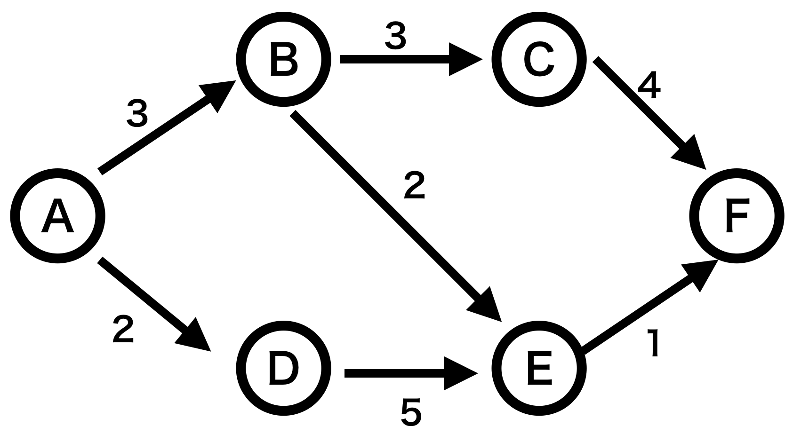

[トップページに戻る](https://teamhimeh.github.io/simdev_intro/index.html)

# 大規模な開発にむけて
本章ではより複雑・大規模な本体開発に必要となることがらを解説する．

## コーディング規約
多くのオープンソース・プロジェクトがそうであるように，Simutransにもコーディング規約が存在する．コーディング規約はdocumentation/coding_styles.txtにあるので一度必ず目を通されたい．コーディング規約に違反するようなコードを本家フォーラムに投稿すると，フォーラム構成員に悪い印象を与えてしまう．

多くのルールはオブジェクト指向プログラミングではあたりまえの事柄だが，中には経験のあるプログラマでも注意が必要なことがらもある．

1.  整数型は`uint8`や`sint32`などを使い，`int`や`long`を使用してはならない．
1.  if文では実行する行が1行だけでも必ず`{}`をつけなければならない．
1.  if文では`&&`などで条件をつなぐとき，前後半角2スペースの空白を入れなければならない．for文の条件式も2スペースの空白を入れる．（少しコードを眺めればそうなっているが，すべての箇所で厳密に守られているわけではない．）
1.  定数変数ではなくマクロ定義かenumを使う．
1.  編成，vehicle，線路などオブジェクトごとに好まれる変数名がある．詳しくはコーディング規約参照．

特に，近年のSimutrans standard開発ではコードの可読性，ロジックの安全性，ネーミングの妥当性が極めて重要視されている．初参戦者が本家フォーラムにパッチを投げると，これらの事柄について厳しい審査が行われることになる．

## テンプレート
C++プログラミングの世界ではコンテナやアルゴリズムを扱うときStandard Template Library（STL）を使うのが一般的である．しかし，SimutransのコードではSTLを使った行はほぼ見られない．STLの使用は避けられており，そのかわりSimutransで独自に用意されているテンプレート群を使うことになる．なお，C++におけるテンプレートとはデータ型にとらわれずコードを書くことを可能にする機能のことである．

最もよく使うであろうvectorを例にすると，「ふつう」のC++プログラムでは以下のように`std::vector`を使うであろう．
```c++
#include <vector>

std::vector<int> v;
```

しかし，SimutransではSTLライブラリを使わないので以下のように宣言する．
```c++
#include "tpl/vector_tpl.h"

vector_tpl<sint32> v;
```

include文からわかるようにvector_tpl.hはtplディレクトリに配置されている．tplディレクトリにはSimutransで使えるテンプレート群が集められており，ハッシュテーブル，vector，重み付きvector，リスト構造などが利用可能である．

Simutransの独自テンプレート群はSTLとは別モノなので用意されている関数にいくらか違いがある．例えば，vectorの要素数を取得するとき`std::vector`なら
```c++
int size = v.size();
```
で取得するが，`vector_tpl`の場合
```c++
int size = v.get_count();
// v.get_size()はvectorの容量を返す
```
となる．このように，定義されている機能に違いがあるので，利用するときはヘッダファイルに目を通して所望の機能がどんな名前で定義されているのか確認する必要がある．

また，乱数はutils/simrandom.hで定義されている`simrand()`関数を主に用いることになる．ソートなどのアルゴリズム関数は独自に用意されてはいないので，`#include <algorithm>`して利用することになる．

<!--
% 画像劣化の話とか

% draw image系
% sync step系
-->

## 計算量オーダー
世の中にあまた存在するシミュレーション系ゲームに対してSimutrans
がもつ優位性の一つに，動作の軽さがある．処理量を低く保つ（あるいはさらに低減させる）ことはSimutransにとって重要である．処理量を著しく増加させる改造は本家フォーラムでは原則受け入れられない．

処理量を半定量的に判断する基準として計算量オーダーというものがある．例えば，２次元配列arrayを初期化する以下のコードを考えよう．
```c++
int n; // あらかじめ値が代入されている
int array[n][n];
for(int i=0; i<n; i++) {
  for(int j=0; j<n j++) {
    array[i][j] = 0;
  }
}
```

このコードでは初期化処理をn^2回行っている．よって，このコードの計算量は`O(n^2)` である．与えられたnが100，1000，1万と増えるに従って処理量は1万，100万，1億回と増えていく．競技プログラミングの世界で使われる一応の目安として，1秒間で実行できる計算量はおよそ1000万回と言われている．このため，もしn=10000であればこのコードを実行するのに10秒もかかってしまうことになる．もし，同じ処理を`O(n)`や`O(nlogn)`といったオーダーの計算量で終えることができれば特にnが大きな領域で劇的に計算量を減らすことができる．

なお，計算量の表記で注意したいのが，例えばアルゴリズムAの処理回数が `n^2+n` ，アルゴリズムBの処理回数が`n^2`であったときに，これらの計算量はAもBも`O(n^2)`と表記されることである．nの1次の項はnが大きくなると2次の項に比べてきわめて小さくなるため一番大きな項のみを評価する．計算量の評価で重要なことはnに対してどんな増え方をするかであるので，定数項はあまり重要ではない．もっとも，実際のソフトウェア開発では定数倍の処理量削減が大きな効果をもたらすこともあり，計算量をどこまで考慮して実装するかはケース・バイ・ケースである．

計算量を正しく推定することは機能追加の議論にとっても重要である．定量的な評価を提示することで，提案する機能がパフォーマンスに悪影響を及ぼさないことを主張することができる．そこで，本家フォーラムにおける議論でよく「重い」とされる処理について計算量の観点から簡単に整理しておく．

### section{ルート検索}



ルート検索は編成が現在地から目的地への最短経路を見つけるために行われる．この処理は **最短経路問題** という数学的な問題に帰着できる．最短経路問題とは次のような問題である．例えば，上図のような道があって（専門的にはこれを**グラフ**という．）矢印に添えられた数字はその道を通るコストである．図ではAからBに直接行く経路のコストは3である．このとき，AからFに行くのに最もコストの低いルートはどれかを探索する問題である．このくらい小さなグラフであれば人力で求めることが可能（今回の場合A→B→E→Fが最短経路でコストは`3+2+1=6`となる．）であるが，コンピュータがこの問題を解くにはどうすればよいのだろうか？

最短経路問題を解くために広く使われているアルゴリズムとして， **ダイクストラ法** がある．ここではアルゴリズムの詳細な説明は避けるが，平均的な計算量としては二分ヒープを使った場合`O((E+V)logV)`になることが知られている．ここでEは探索空間の枝，Vは探索空間のノードである．simutransではこれにヒューリスティクス（人間が先天的に与えるパラメータ）を加味した **A*探索** を採用しているため，計算量は純粋なダイクストラ法より小さくなる．

simutransでルート探索を利用するときは`route_t::find_route()`や`route_t::calc_route()`を利用することになるため，アルゴリズムの中身を意識することはない．しかし，ルート探索は大きな処理を伴う（特に大きなマップで問題になる）ため，ルート探索の実行回数を抑えたり，ルート探索を別スレッドに分離するといった工夫が必要になる．

### 並べ替え（ソート）
ルート探索と並んで問題になるのはソートである．ソート問題の例は，「1 4 3 7 6 5 2 8」という数列を小さい順に並べるにはどうすればいいかという問題である．simutransで行われるソートの一つは，車庫ウィンドウで車両を指定された順番に並べてユーザーに提示するといった処理である．ソート問題で高速な解法としてよく知られているのが**クイックソート**である．その平均計算量は`O(n\logn)`である．ある配列（vector）の中身をソートするには一般に`std::sort`が用いられる．例えば，文字列ソートは次のようになる．
```c++
// ソートにおける比較基準を関数で定義する
bool compare_str(const char* a, const char* b) {
  return strcmp(a, b) < 0;
}
vector_tpl<const char*> list; //これをソートする
std::sort(list.begin(), list.end(), compare_str); // compare_strを評価基準とする
```

注意せねばならないのは，その計算量が許されるか許されないかは一般に実験して確認すべきということである．例えば，1万件の車両アドオンがpakセット内にあり，それをソートする場合，ソート処理のオーダーは`O(nlogn)`（logの底は2）なのでソート処理は約13万回回ることになる．1秒で処理できる限界の目安は1000万回なので余裕・・・と思いきや実際にこれを実行すると処理には少なくとも数秒間かかる．この原因を特定することは一般に容易ではないが，一つの原因として比較処理にある程度時間がかかることが挙げられる．このようにアドオン数が増えるとソートに時間がかかるようになる．その対策の例としては，ソートした結果を保存して再利用するといったことが挙げられる．
